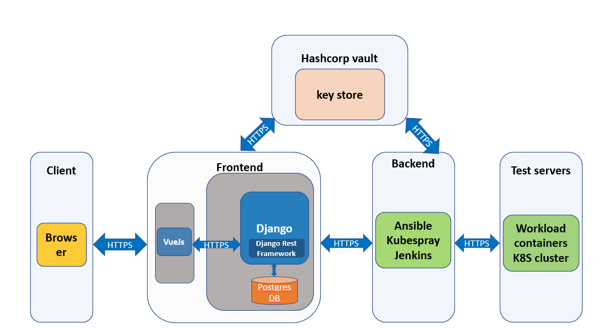

## Introduction

This tool provides the ability to configure and run WSF workload automatically, the configuration contains: Kubernetes installation, Kernel update, Kernel arguments update.
### 
It contains two parts:
1. The frontend page which use VueJS+Django to develop, user can manage servers, and choose workload to configure and run
2. The backend service use python ang go to develop, it does the tasks which sent by frontend page and finally call jenkins pipeline to complete the workload running.
###

## License

See [LICENSE](LICENSE) for details.

## Related projects documentation
Refer to the directory "doc"

## Release note
What is new in this release:
- This tool is production release now
- Changes WSF backend from cumulus to terraform
- Supports WSF new released workloads 

Release Impact 
- In network that could not access to internet need extra offline installation effort to initial this tool  

Known issue
- KVM installation function is not fully ready
- K8s installation may fail on some un-clean CentOS environment
