# 配置Grafana服务

## 下载安装并启动 grafana
**注：若已通过 k8s 部署了 grafana 服务，则跳过 “下载安装并启动 grafana” 这一步骤**

在服务器上依次运行如下命令：

```shell
# 1. 确定服务器上有 wget，unzip 且可用
sudo apt-get update && apt-get -y install wget && apt-get -y install unzip

# 2. 创建 grafana 服务文件夹
sudo mkdir -p /dashboard/grafana/

# 3. 下载指定版本的 grafana 服务包
sudo wget https://dl.grafana.com/enterprise/release/grafana-enterprise-9.0.5.linux-amd64.tar.gz -O /dashboard/grafana/grafana-enterprise-9.0.5.linux-amd64.tar.gz

# 4. 进入 grafana 服务文件夹并赋予文件权限并解压 grafana 服务包
## 4.1 进入相应文件夹
sudo cd /dashboard/grafana/
## 4.2 改变文件权限
sudo chmod 777 grafana-enterprise-9.0.5.linux-amd64.tar.gz
## 4.3 解压文件
sudo tar -zxvf grafana-enterprise-9.0.5.linux-amd64.tar.gz

# 5. 创建子级目录
sudo mkdir -p /dashboard/grafana/grafana-9.0.5/data/plugins/

# 6. 启动 grafana 服务
## 6.1 进入可执行文件所在目录
sudo cd /dashboard/grafana/grafana-9.0.5/bin
## 6.2 启动服务，这一步前需确认服务器 3000 端口未被占用
sudo nohup ./grafana-server &
```

查看 /dashboard/grafana/grafana-9.0.5/bin 文件夹下的 nohup.out 文件，若如下图所示，则表明服务启动成功，

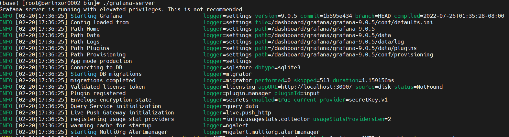

## 进入服务创建用户

在 nohup.out 文件中可以看到，当前 grafana 服务运行在服务器的 3000 端口，通过 http://<server_ip>:3000 访问 grafana 服务，

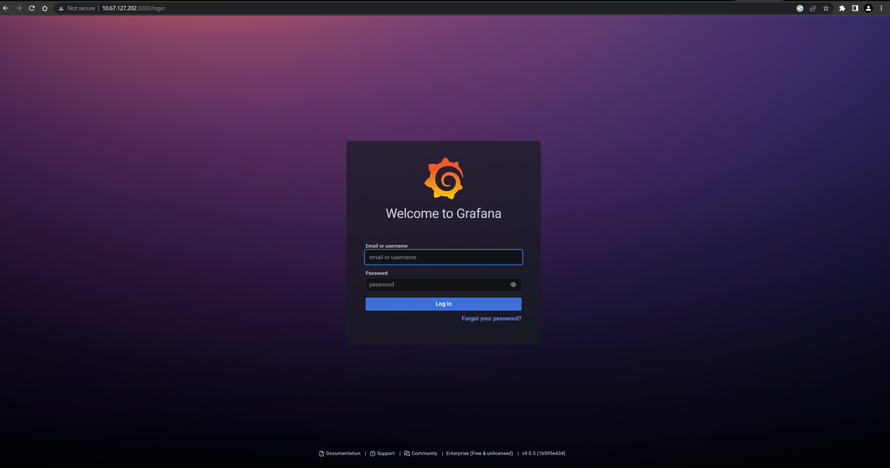

初始用户为 admin，密码同为 admin，输入后点击 Log in 按钮，会提示用户更新密码，


提交新密码后，可以查看 grafana 服务的主页面，如下图所示：

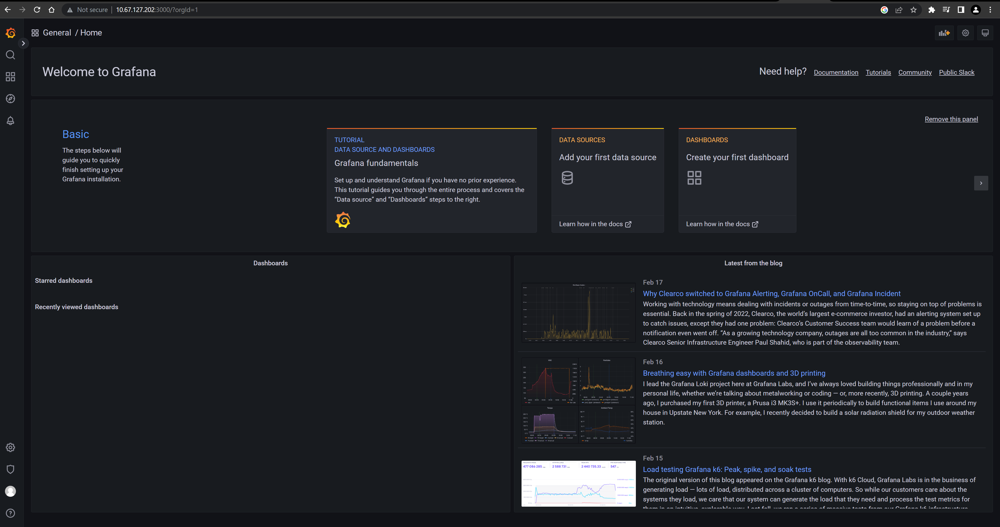

## 配置 grafana

### 获取 api key

在 grafana 左上角的导航栏中，点开 Configuration 一栏，点击其中的 API keys，进入 API keys 的管理页面，

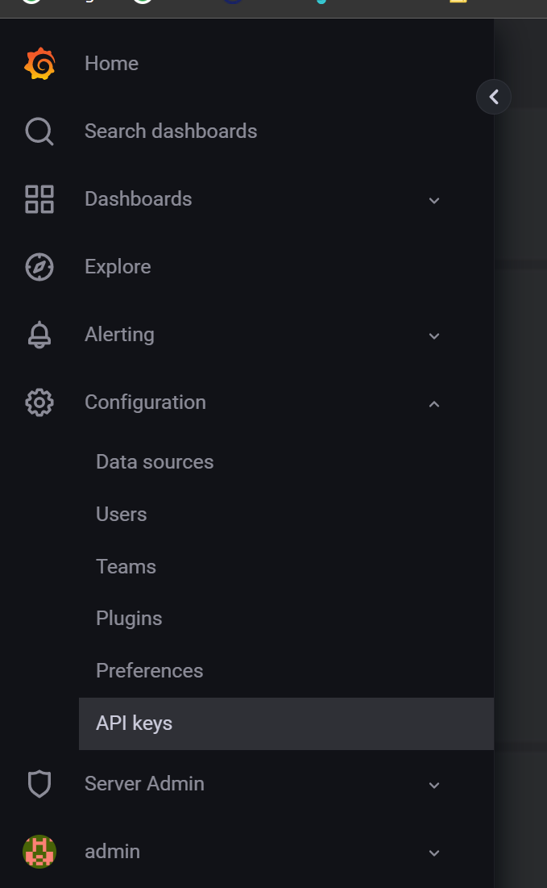

点击 New API key 按钮，

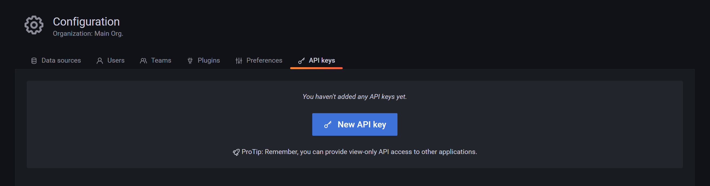

创建一个用来进行 grafana 服务配置的 API key，名字任意，Role 选择 Admin，Time to live 根据需要选择（确保在此 API key 存活期间完成本配置流程），点击 Add 按钮，

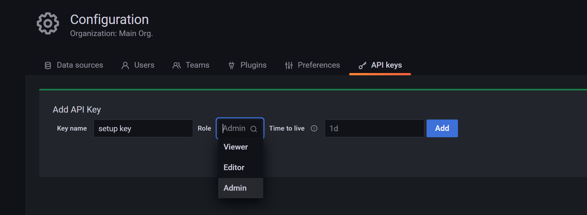

点击 Add 按钮后有如下弹出框，该 API key 仅出现一次，我们需要将其记录存储下来，后续执行脚本时需要提供该 API key，


### 执行自动化配置脚本

在 grafana/script 文件目录下，运行脚本自动配置 grafana 的 data source 与 dashboard，命令如下：

```shell
sudo ./setup.sh
```

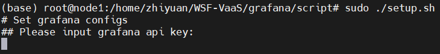

根据提示输入刚刚在 grafana 网页中生成的 API key，按回车键后，脚本继续运行，

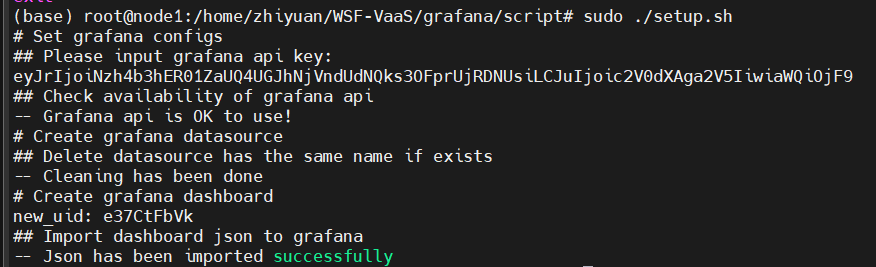

出现如上图所示字样，表明脚本执行成功，data source 与 dashboard 均配置成功。

### 配置数据库密码

进入 grafana 服务网页，点击网页左上角的箭头打开导航栏，点击 Configuration 下面的 Data sources 进入数据源配置页面，


点击刚刚通过脚本创建的 data source PostgreSQL，

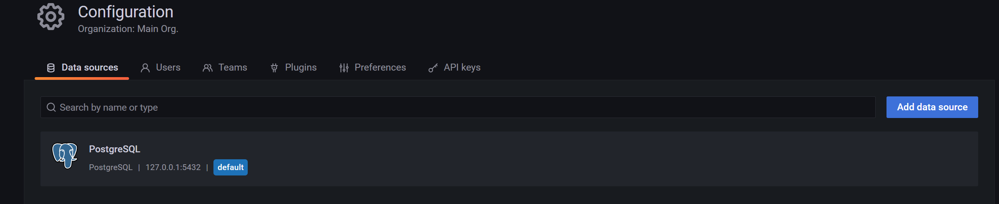

为确保数据安全，我们需要在该 data source 的详情页配置数据库密码，输入密码后，点击 Save & test 按钮，

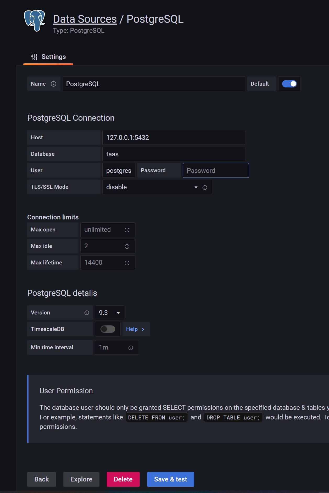

出现如下图所示提示，说明密码更新成功，

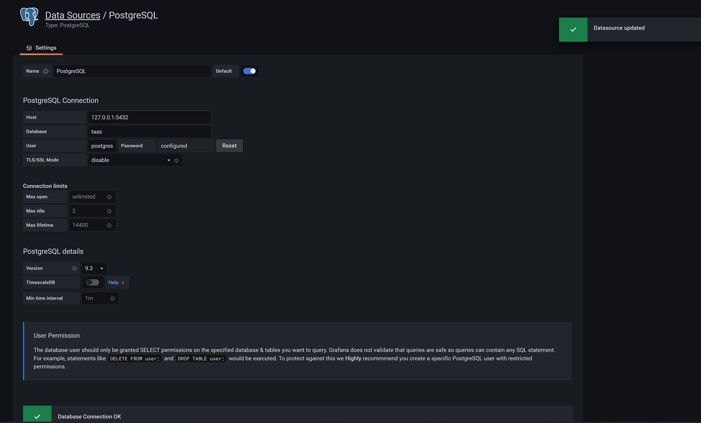

## 配置 dashboard 链接

### 获取 dashboard_url

点击 grafana 主页左上角的箭头，选择弹出的导航栏中 Dashboards 层级下的 Browse，可以看到我们通过脚本配置的 dashboard，

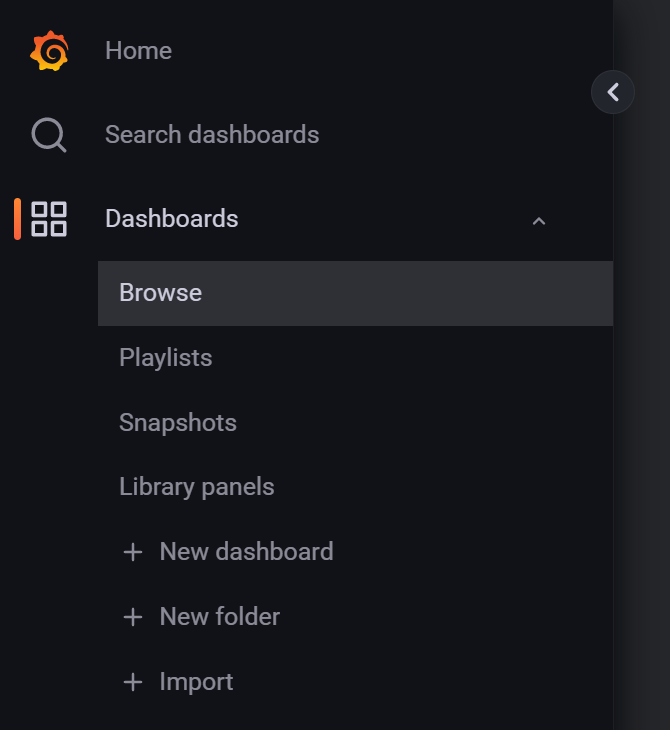

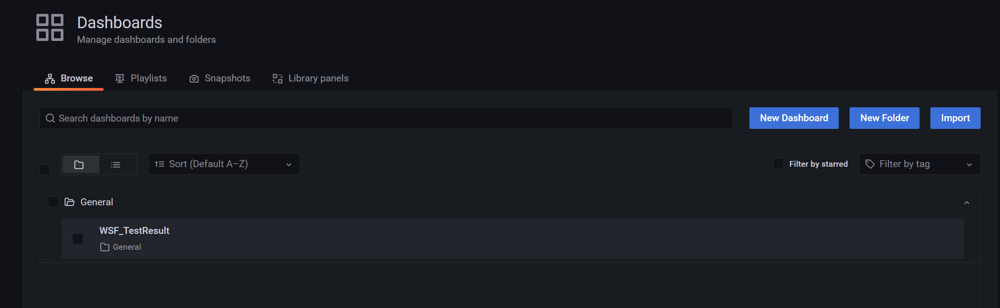

点击 WSF_TestResult，进入该 dashboard 的详情页，此时可以成功查看所有 local test result 信息，

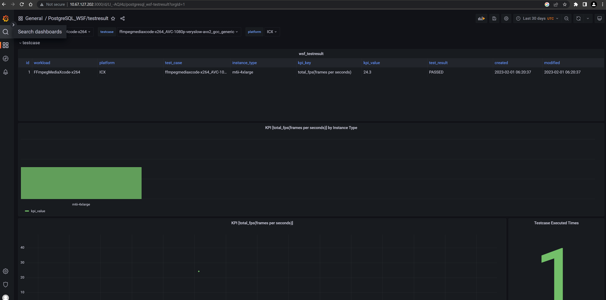

我们点击该页面顶部的链接按钮，在弹出的弹框中点击 Copy，复制该页面的链接，为下一步做准备，

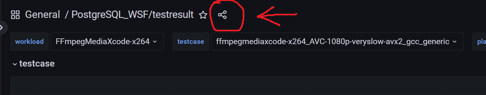

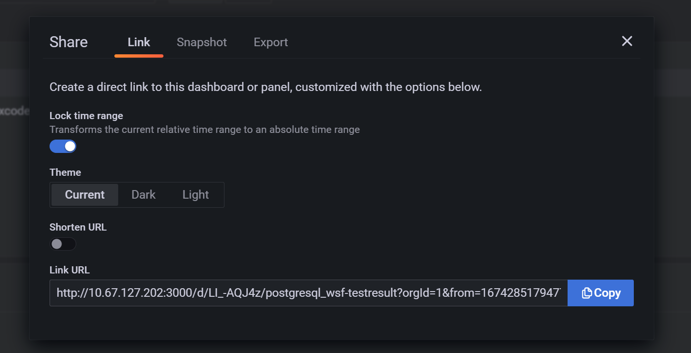

### 在 VaaS 中配置 dashboard_url

使用管理员进入 VaaS 网页，点击顶部导航栏中的 Admin 进入管理页面，

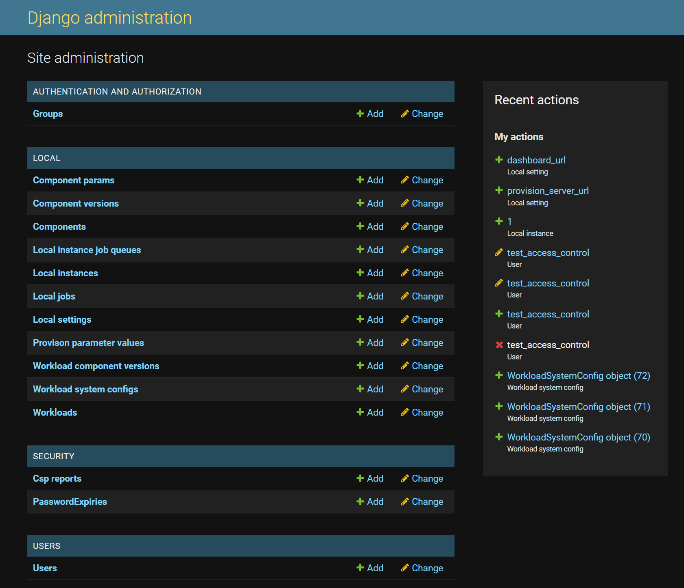

点击 Local settings 进入详情页，点击页面右上角的 ADD LOCAL SETTING 按钮，Name 一栏确定为 dashboard_url，Value 一栏为上一步中我们复制的 dashboard link，填写完成点击 SAVE 按钮保存

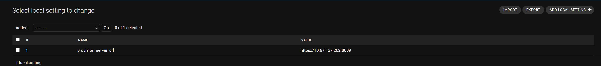

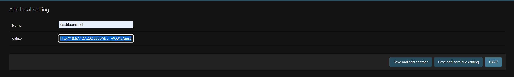

此时我们可以在 VaaS 的主页面通过点击 Dashboard 进入 grafana 的 dashboard 页面，

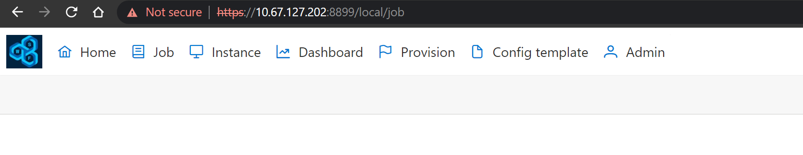

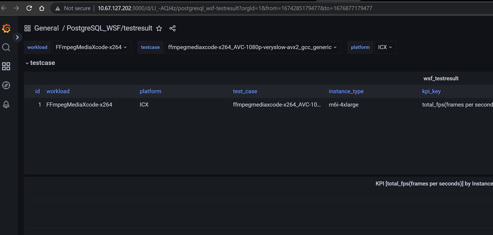

## 注意

首次通过未访问过 grafana 服务或清理过缓存的浏览器访问 grafana 服务需要输入用户名与密码。

符合上述条件的情况下，通过 VaaS 的 Dashboard 导航访问 grafana 服务也需要输入用户名与密码。

通过自动化脚本进行 data source 与 dashboard 的配置时，需要确保手动清除 grafana 网页中的 data source 和 dashboard。