# K8s Prometheus & Grafana Guide

## 注意

**使用该安装手册进行配置前，需要确认 server 上已安装配置了 k8s**

## K8s部署prometheus+Grafana

使用Prometheus+Grafana解决方案来监控k8s集群，Prometheus收集的信息包括内存、CPU、磁盘性能和网络 IO等资源。使用 [kube-prometheus](https://github.com/prometheus-operator/kube-prometheus) 项目来简单地配置监控组件，其中包括 [Prometheus Operator](https://github.com/prometheus-operator/prometheus-operator)的组件来进行k8s监控，并有一系列默认的dashboard和警报规则。

使用步骤：

1.  已配置并确认 kubectl 可以正常工作

| \$ kubectl cluster-info |
| ----------------------- |

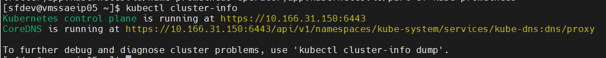

2.  克隆kube-prometheus项目

| git clone <https://github.com/prometheus-operator/kube-prometheus.git> |
| ------------------------------------------------------------ |

3.  进到kube-prometheus目录下

| cd kube-prometheus |
| ------------------ |

4.  创建一个命名空间和所需的CustomResourceDefinitions，所有的CRD资源的定义都在setup下面

| kubectl create -f manifests/setup |
| --------------------------------- |

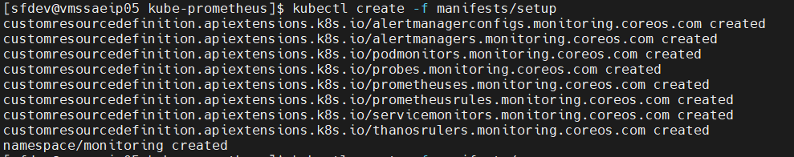

5.  查看monitoring命名空间的状态

| kubectl get ns monitoring |
| ------------------------- |

6.  继续部署 Prometheus 监控堆栈，部署监控组件，打印输出如下：

| kubectl create -f manifests/ |
| ---------------------------- |

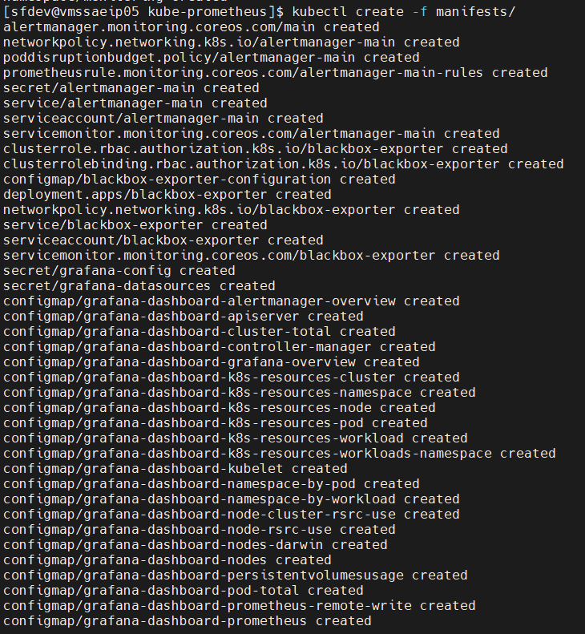

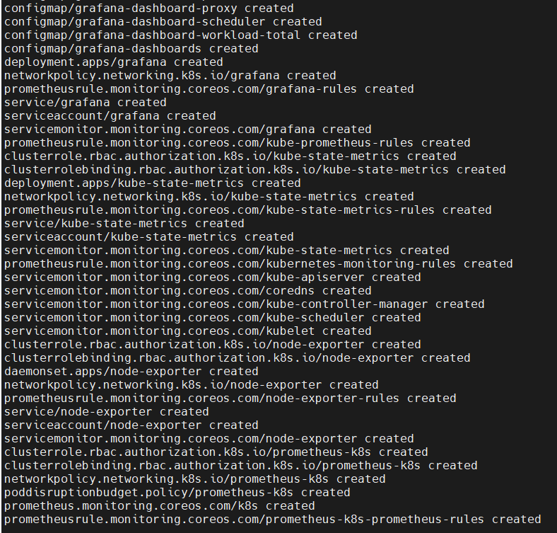

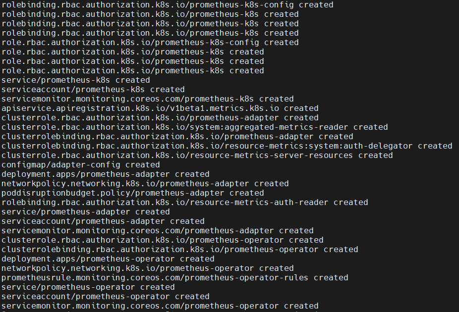

7.  检查服务

| \$ kubectl get pods -n monitoring |
| --------------------------------- |

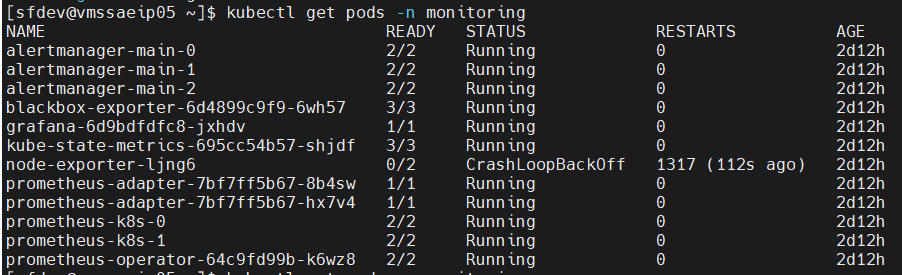

8.  使用工作节点 IP 地址和端口访问 Prometheus、Grafana 和 Alertmanager 仪表板，必须编辑服务并将类型设置为 NodePort

1）Prometheus

| kubectl --namespace monitoring patch svc prometheus-k8s -p '{"spec": {"type": "NodePort"}}' |
| ------------------------------------------------------------ |

2）Alertmanager

| kubectl --namespace monitoring patch svc alertmanager-main -p '{"spec": {"type": "NodePort"}}' |
| ------------------------------------------------------------ |

3）Grafana

| kubectl --namespace monitoring patch svc grafana -p '{"spec": {"type": "NodePort"}}' |
| ------------------------------------------------------------ |

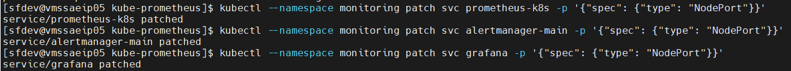

9.  确认每个服务都分配了一个端口：

| \$ kubectl -n monitoring get svc \| grep NodePort |
| ------------------------------------------------- |

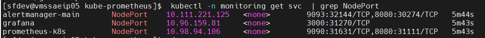

10. 访问网页：

格式：http://node_ip:端口

Prometheus：http://10.166.31.150:31631/

Grafana：http://10.166.31.150:31270/

Alerttmanager：http://10.166.31.150:32144/ 

另：

1.  如果所有服务都起来的情况下无法访问网页，可以试试刷新iptables：

| iptables --flush&iptables -tnat --flush & iptables -P FORWARD ACCEPT |
| ------------------------------------------------------------ |

如果访问页面过程中会出现error，尝试用以下命令来刷新iptables：

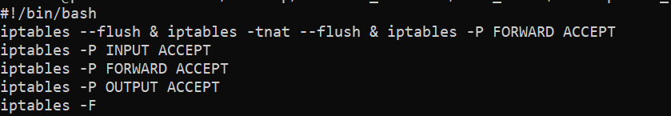

**注：**如果刷新iptables还是无法访问网页，可能是kube-prometheus版本与k8s不兼容的问题，最好是按照下面这个表打勾的来安装，比如我在k8s版本1.21的情况安装了release-0.11版本，始终无法访问网页，后来重装0.9版本就可以访问网页了，在安装0.9版本的过程中有提示warning。

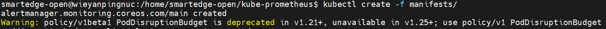

把代码里的apiVersion根据提示修改了重新运行命令就不会warning了。

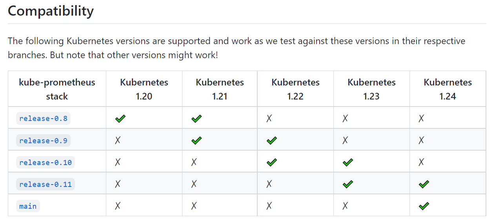

2.  如果想要销毁Promethues堆栈，使用如下命令：

| kubectl delete --ignore-not-found=true -f manifests/ -f manifests/setup |
| ------------------------------------------------------------ |

3.  想要查看安装部署的各个版本使用如下命令：

进到目录kube-prometheus/manifests，执行：

| grep -riE 'quay.io\|k8s.gcr\|grafana/' \* |
| ----------------------------------------- |

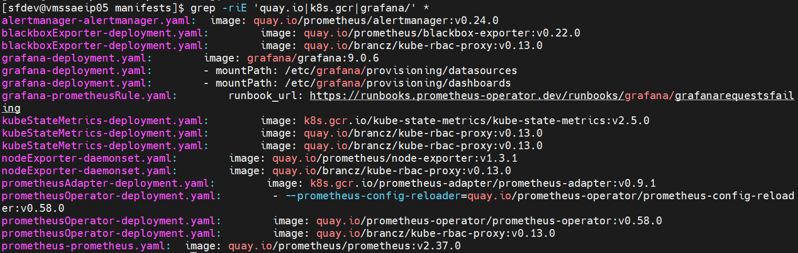

4.  Danshboard中panel无法显示数据的问题：

注意根据不同的面板选择不同的数据格式和数据类型，只有当前选择时间区间的最晚的时间点有数据时才可以使用Instant类型，否则会显示No Data。

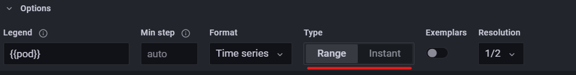

在k8s上部署可参考：

<https://computingforgeeks.com/setup-prometheus-and-grafana-on-kubernetes/> 

<https://github.com/prometheus-operator/kube-prometheus>

## 根据service层级监控数据的Dashboard的配置

在Grafana中获取service标签可以使用如下语句，匹配原则为pod=“\$service.\*”，即service名字是pod名字的前缀。进入dashboard后，在页面右上角的dashboard settings-\>Variebles里可进行指标添加和修改：

| label_values(kube_service_info{job="kube-state-metrics", cluster="\$cluster"}, service) |
| ------------------------------------------------------------ |

根据service筛选结果如图：

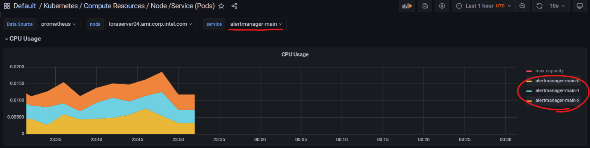

## 监控自己的Workload信息

1.  在service层级想展示自己的Workload数据需要注意service名字和pod能匹配，以Wordpress为例，修改service名字后（还需要修改相关用到service名字的所有配置，否则workload会跑不起来）是能看到数据的：

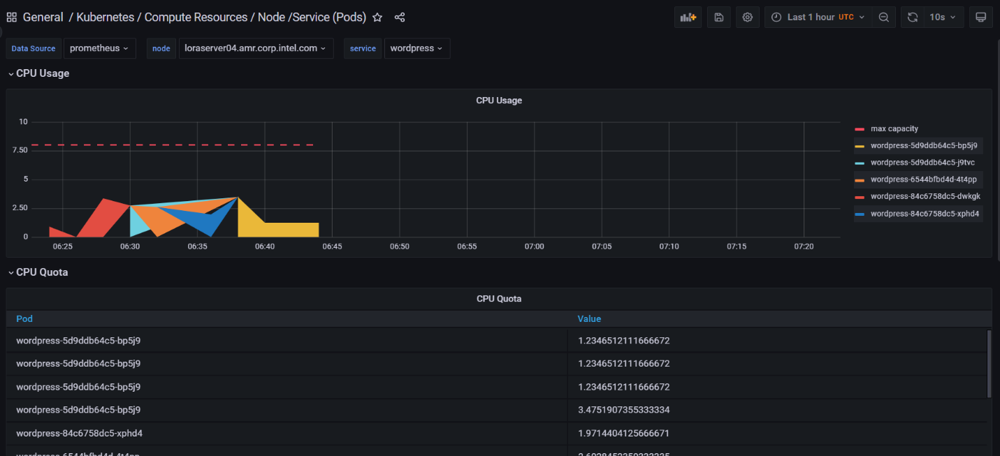

service层级dashboard的json内容如下，可直接import使用：

<https://intel-my.sharepoint.com/:u:/p/rui_tang/Ecv1ech7P-9Jle2eF_R0K2IB0xohk3VqLixUx-ig8tCdQw>

2.  如果要使用Compute Resources/Namespace（Pods），对于自己的Workload，Headlines中的面板需要拿到cpu和memory的limits和requests数据才能正常展示，如果自己的workload没有配置的话会显示No Data：

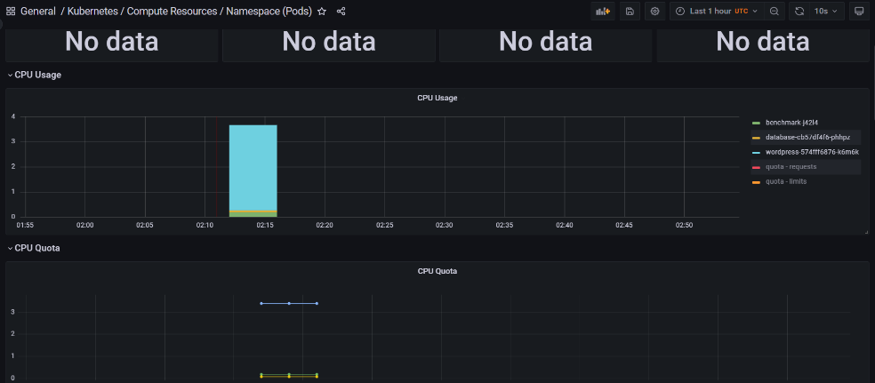

那是因为没有配置相关信息，可以在相关配置文件中进行配置，以Worpress为例，在client.yaml、wordpress.yaml、database.yaml添加resources配置：

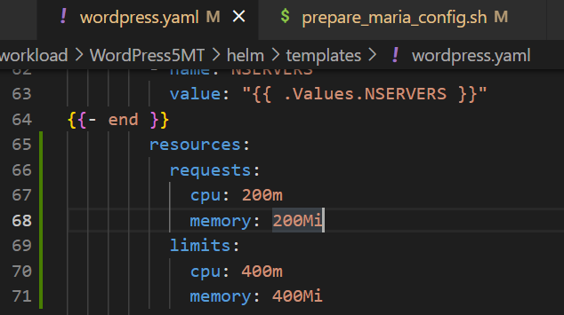

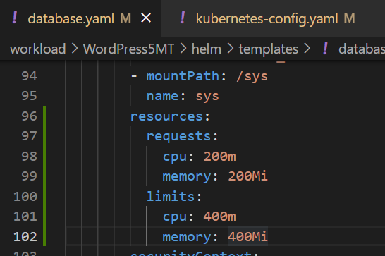

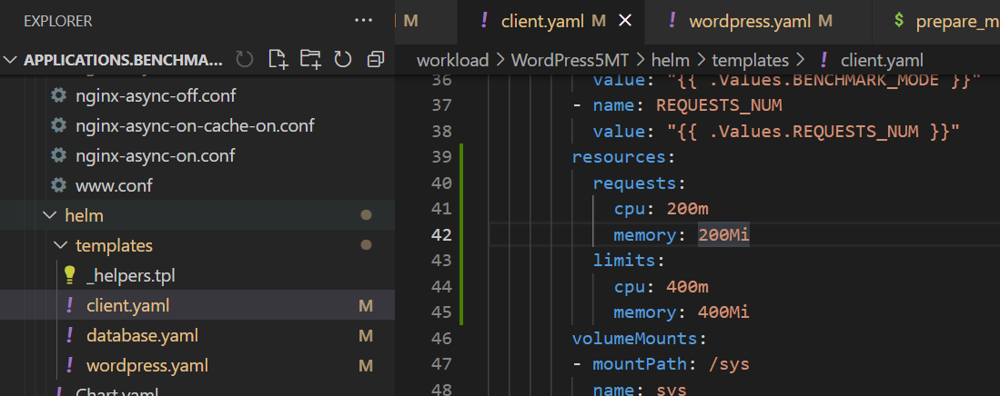

**注意**：需要根据实际情况来写，否则可能会导致pod出问题（worload跑不起来），此处只是为了展示随便写的数据。

获取到数据后展示如图：

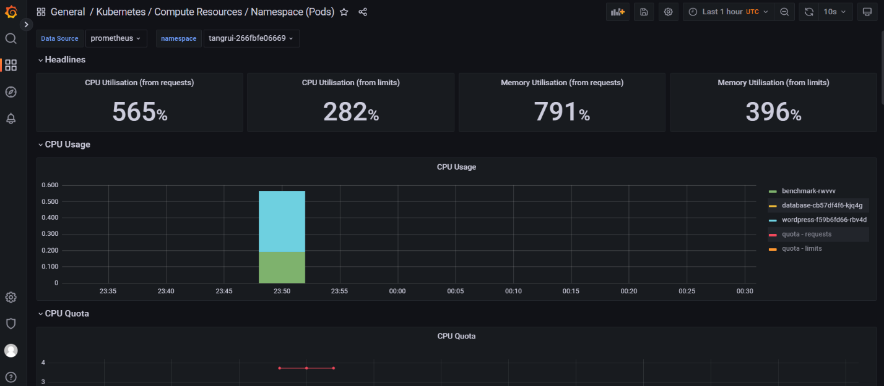