# Workload自动部署和测试工具系统部署指南

## 1. 环境要求

系统支持分布式部署，若无特殊要求，默认把所有前后端服务部署到一台服务器

操作系统: ubuntu 18.04/Centos 8.x（本文的命令都是基于centos8，如果是ubuntu某些命令可能有细微差别）

内存要求: 32G以上

磁盘要求: 1TB以上

## 2. 下载代码仓库

```git
git clone https://github.com/intel/workloads-auto-deployment-test-tools.git WSF-VaaS
```

## 3. 部署后端服务

### 3.1 项目运行环境初始化

运行WSF-VaaS/auto-provision/deploy目录下的init.sh初始化环境。

#### 3.1.1 进入目录 WSF-VaaS/auto-provision/deploy

```shell
cd WSF-VaaS/auto-provision/deploy
```

#### 3.1.2 运行init.sh 脚本，进行自动化项目运行环境初始化, 需要手动输入服务器通信IP来生成证书

```shell
./init.sh
```

###### 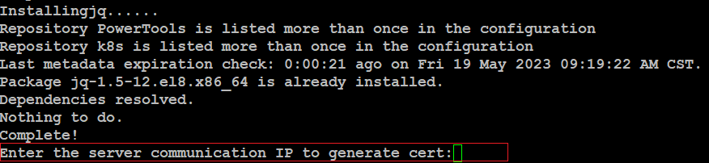

#### 3.1.3 修改WSF-VaaS/auto-provision/conf/conf.json

```shell
vi WSF-VaaS/auto-provision/conf/conf.json
```

替换“Project path”为项目实际的地址，例如 “/home/kevin/WSF-VaaS/auto-provision/”，注意最后一级目录是“auto-provision/”,要以“/”结尾

### 3.2 部署vault

vault是一个密码/证书管理工具，通过上一步中运行init.sh脚本，该工具已被安装到机器中，接下来进行vault相关配置。

#### 3.2.1 创建 /usr/local/vault文件夹并进入该目录

```shell
mkdir -p /usr/local/vault
cd /usr/local/vault
```

#### 3.2.2 在该文件夹中创建config.hcl配置文件

```shell
touch config.hcl
# 替换以下内容的“<Vault服务器IP>:”为真实的部署服务器IP之后，把内容写入文件config.hcl
storage "raft" {
  path = "./data"
  node_id = "node1"
}

listener "tcp" {
  address = "<Vault服务器IP>:8200"
  tls_disable = "true"
}

api_addr = "http://<Vault服务器IP>:8200"
cluster_addr = "https://<Vault服务器IP>:8201"
ui = true
```

#### 3.2.3 创建 /usr/local/vault/data 文件夹

```shell
mkdir /usr/local/vault/data
```

#### 3.2.4 启动vault服务（需确保当前自己处于/usr/local/vault目录下）

```shell
cd /usr/local/vault
nohup vault server -config=config.hcl &
```

输入该命令并回车后，打开当前目录的output.log,如果有字符串“ Vault server started!”则说明启动服务成功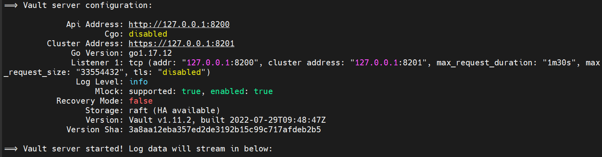

#### 3.2.5 设置VAULT_ADDR环境变量

```shell
vim /etc/profile
```

进入文件后在文件最后添加 export VAULT_ADDR="http://<Vault服务器IP>:8200"

保存后退出，并执行

```shell
source /etc/profile
```

#### 3.2.6 初始化vault服务，执行如下命令：

```shell
vault operator init
```

输出如

###### 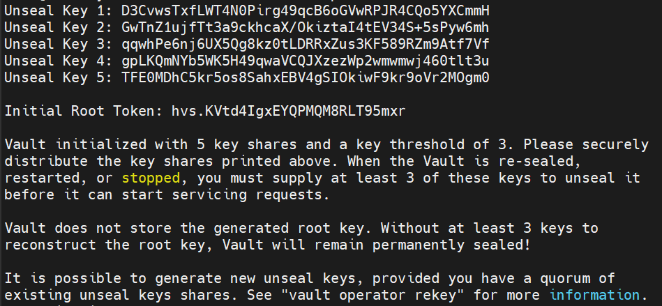

记录下五个“Unseal key”和“Initial Root Token”等后续步骤使用

#### 3.2.7 Unseal vault，执行命令：

```shell
vault operator unseal
```

###### 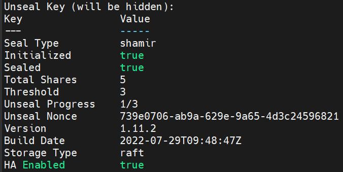

<u>说明：需要执行vault operator unseal这个命令三次，每次要输入一个不同的Unseal Key（从上一步生成的5个Unseal Key中任选三个）。</u>

全部通过后，输出如下：

###### 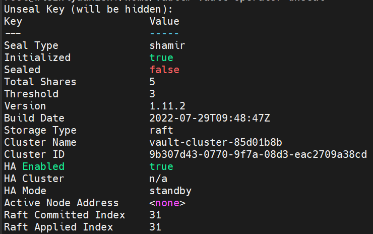

#### 3.2.8 登录vault，执行如下命令：

```shell
vault login
```

根据提示输入Initial Root Token（由第6步获取），认证成功后输出如下：

###### 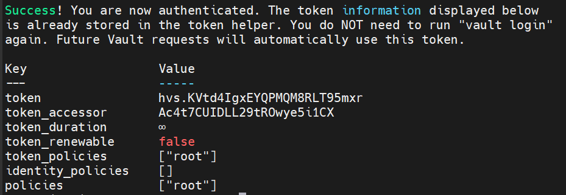

#### 3.2.9 设置VAULT_TOKEN环境变量

```shell
vim /etc/profile
```

进入文件后在文件最后添加 export VAULT_TOKEN="<第六步生成的‘Initial Root Token’>"

保存后退出，并执行

```shell
source /etc/profile
```

#### 3.2.10 启动secrets engine，执行如下命令：

```shell
vault secrets enable -version=1 -path kv kv
```

输出如下：

###### 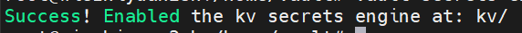

#### 3.2.11 修改WSF-VaaS/auto-provision/conf/conf.json

```shell
vi WSF-VaaS/auto-provision/conf/conf.json
```

替换“\<Vault server IP address\>”为实际的vault服务器IP

替换“\<Vault token\>”为第六步生成的‘Initial Root Token’

#### 3.2.12 向vault中输入数据

```shell
vault kv put -format=json kv/wsf-secret-password provisionPassword=<用户自定义，建议复杂密码> provisionUserName=admin
```

#### 3.2.13 验证配置是否成功

输入命令

```shell
vault kv get -format=json kv/wsf-secret-password
```

 验证是否配置成功，将上一步中配置的所有相关数据输出则说明配置成功。

### 3.3 部署后端auto-provision服务

#### 3.3.1 当环境中具有不符合条件的golang版本时，卸载原有的golang环境(需要go version 为1.18+)

```shell
sudo yum remove golang-go
sudo rm -rf /usr/local/go
sudo rm -rf /usr/bin/go
```

#### 3.3.2 下载安装包并安装golang

```shell
wget --no-check-certificate wget --no-check-certificate <https://dl.google.com/go/go1.18.3.linux-amd64.tar.gz>
sudo tar -C /usr/local -zxvf go1.18.3.linux-amd64.tar.gz
```

#### 3.3.3 修改golang相关的环境变量

```shell
sudo vim ~/.bashrc

# 添加内容如下(根据自己的用户名设置GOROOT和GOOPATRH)：
export GOROOT=/usr/local/go
export PATH=$PATH:$GOROOT/bin
export GOPATH=/home/li/go  
```

###### 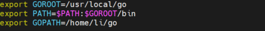

```shell
source ~/.bashrc
```

#### 3.3.4 校验go是否安装成功，使用命令go version

###### 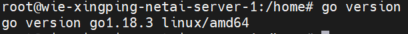

#### 3.3.5 安装go相关的lib

```shell
cd WSF-VaaS/auto-provision
go mod tidy
```

#### 3.3.6 安装conda

```shell
wget <https://repo.anaconda.com/miniconda/Miniconda3-py39_4.12.0-Linux-x86_64.sh>
chmod +x ./Miniconda3-py39_4.12.0-Linux-x86_64.sh
./Miniconda3-py39_4.12.0-Linux-x86_64.sh # 按照提示进行安装。
# 安装完成后运行：
source ~/.bashrc
```

#### 3.3.7 创建conda的虚拟环境(python3.8+)

```shell
conda create --name env_1 python=3.9.12 pip
conda activate env_1
conda update -y -n env_1 pip
pip3 install ansible==5.7.1 click netaddr ruamel.yaml
```

<u>注意：后端程序必须在env_1这个环境中运行。</u>

#### 3.3.8 下载kubespray代码

运行WSF-VaaS/auto-provision/task/cluster/getkubespray.sh脚本下载kubespray代码

```shell
cd WSF-VaaS/auto-provision/task/cluster
./getkubespray.sh
```

### 3.4 启动后端服务

依次执行如下命令：

```shell
# 1
cd WSF-VaaS/auto-provision

# 2
go build

# 3
nohup ./api-provision &

# 4 执行如下命令检查8089端口目前是否被api-provis占用
netstat -tlnp |grep 8089
```

若正确监听8089端口（如下图）则配置成功

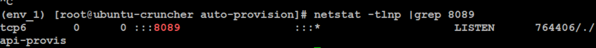

## 4. 部署前端服务

### 4.1 安装docker>=20.10.17,参考以下链接：

<https://docs.docker.com/engine/install/>

```shell
# 删除已有的docker版本
yum remove -y docker-ce 
docker-client 
docker-client-latest 
docker-common 
docker-latest 
docker-latest-logrotate 
docker-logrotate 
docker-engine

# 删除docker主目录，默认是/var/lib/docker
rm -rf /var/lib/docker

# 删除docker的配置目录
rm -rf /etc/docker/*

# 安装docker：
# 1
yum install -y yum-utils yum-config-manager --add-repo https://download.docker.com/linux/centos/docker-ce.repo
# 2
yum list docker-ce --showduplicates | sort -r
# 3
yum install -y docker-ce docker-ce-cli containerd.io docker-compose-plugin
# 4
systemctl enable docker
# 5
systemctl start docker
```

### 4.2 配置docker

```shell
# 1 下载必要的image
docker pull docker/dockerfile:1

# 2 配置insecure registry，让服务器能够访问到启起来的仓库
vi /etc/docker/daemon.json

#   在daemon.json文件中添加如下内容
{
"insecure-registries": ["服务器IP:5000"],
"data-root": "/var/lib/docker"
}
# 注意：data-root默认是“/var/lib/docker”, 建议更改目录到空间较大的分区，最好大于100G

# 3 重启docker让配置生效
systemctl daemon-reload
systemctl restart docker
```

### 4.3 进入到WSF-VaaS/portal目录，修改文件docker-compose.yml

```shell
cd WSF-VaaS/portal
vi docker-compose.yml
```

替换内容“Enter vault addres here”为/etc/profile里面的变量VAULT_ADDR的值，格式为“ http://<Vault 服务器IP>:8200 ”

替换内容“Enter vault toke here” 为/etc/profile里面的变量VAULT_TOKEN的值

自定义postgres数据库的密码，并填入POSTGRES_PASSWORD: ''

### 4.4 修改django配置

修改文件WSF-VaaS/portal/backend/taas/settings.py, 配置可以访问的主机列表

ALLOWED_HOSTS = ['localhost', '127.0.0.1']，默认只允许本机访问，用户可以根据实际的安全规则自己定义允许的访问IP列表，如果需要设置所有机器都能访问，替换为ALLOWED_HOSTS = ['*']

修改文件WSF-VaaS/portal/backend/taas/settings_dev_docker.py, 配置postgres数据库的密码

DATABASES = {

    'default': {
        'ENGINE': 'django.db.backends.postgresql',
        'NAME': 'taas',
        'USER': 'postgres',
        'PASSWORD': '这里填入上一步docker-compose.yml里面定义的postgres密码',
        'HOST': '127.0.0.1',
        'PORT': '5432',
    }

}


### 4.5 编译前端服务需要的docker镜像，输入命令：

```shell
docker compose build
```

如果环境需要proxy，可以在命令中添加参数

```shell
docker compose build --build-arg https_proxy=" https代理地址" --build-arg http_proxy="http代理地址"
```

### 4.6 启动前端需要的docker容器

```shell
docker compose up -d

# 运行如下命令来检查容器有没有启动，状态应该如下图所示
docker-compose ps
```

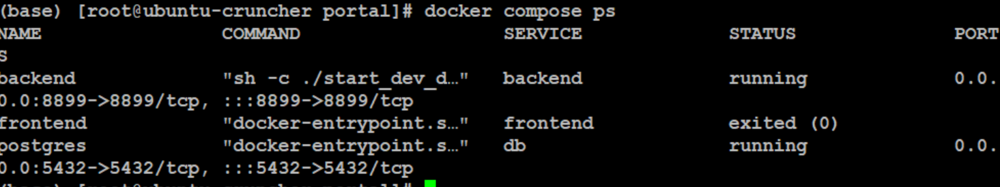

### 4.7 创建admin用户

```shell
# 输入命令:
docker exec -it backend bash

# 运行命令:
python3 manage.py createsuperuser
```

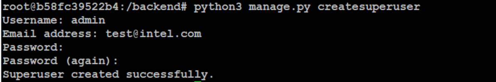

### 4.8 执行“vault kv get -format=json kv/wsf-secret-password”验证vault配置是否成功，并把portal的用户名密码写入vault：

###### 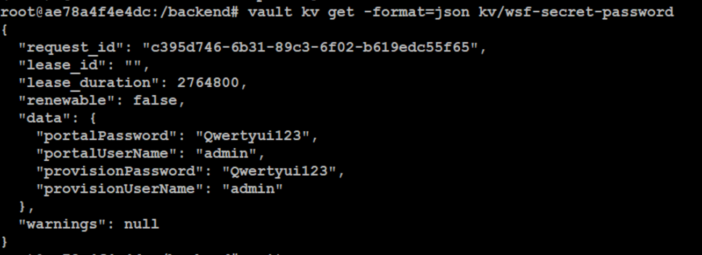

```shell
vault kv put -format=json kv/wsf-secret-password provisionPassword=<vault get 获取到的provisionPassword > provisionUserName=<vault get 获取到的provisionUserName >  portalPassword=<上一步生成的admin密码 > portalUserName=<上一步生成的用户名 >
```

### 4.9 用刚才创建好的admin账户登录portal https://<服务器IP>:8899

### 4.10 录入被测机器信息

#### 4.10.1 点击导航页面admin，进入到后台控制界面

###### 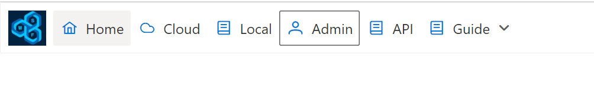

#### 4.10.2 点击“Local instance”,进入机器录入界面

###### 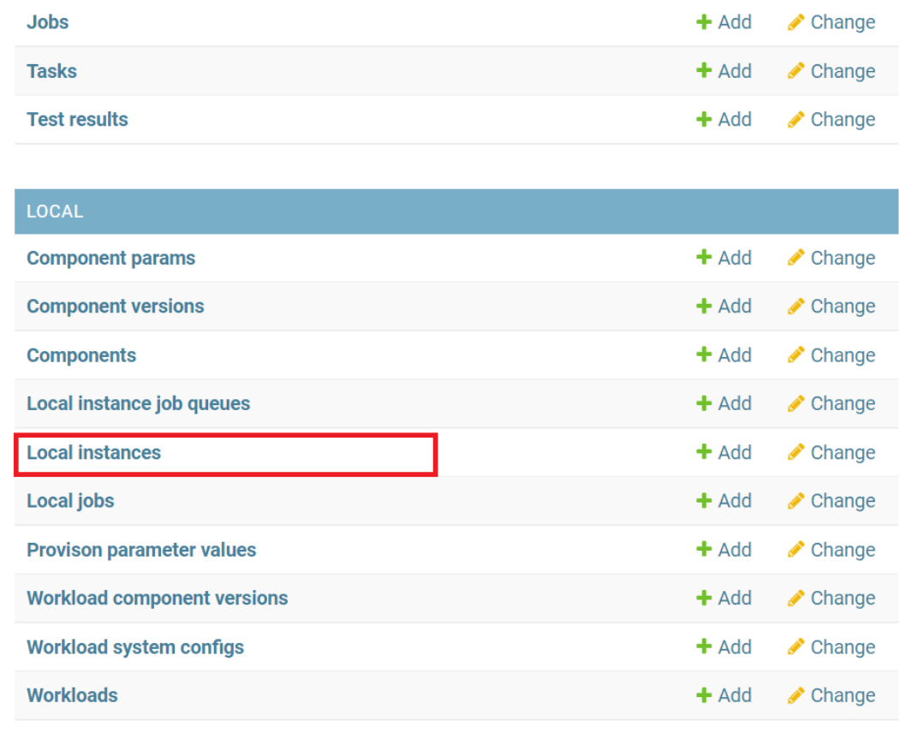

#### 4.10.3 点击“ADD LOCAL INSTANCE”录入机器信息

###### 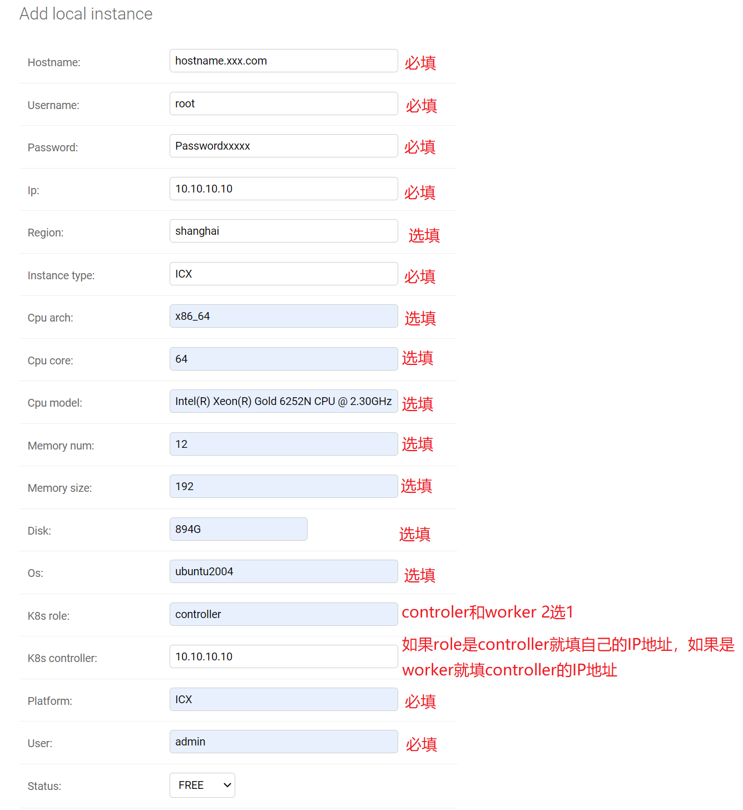

### 4.11 在服务器上面配置对待测机器的无密码登录

运行命令ssh-keygen生成密钥

###### 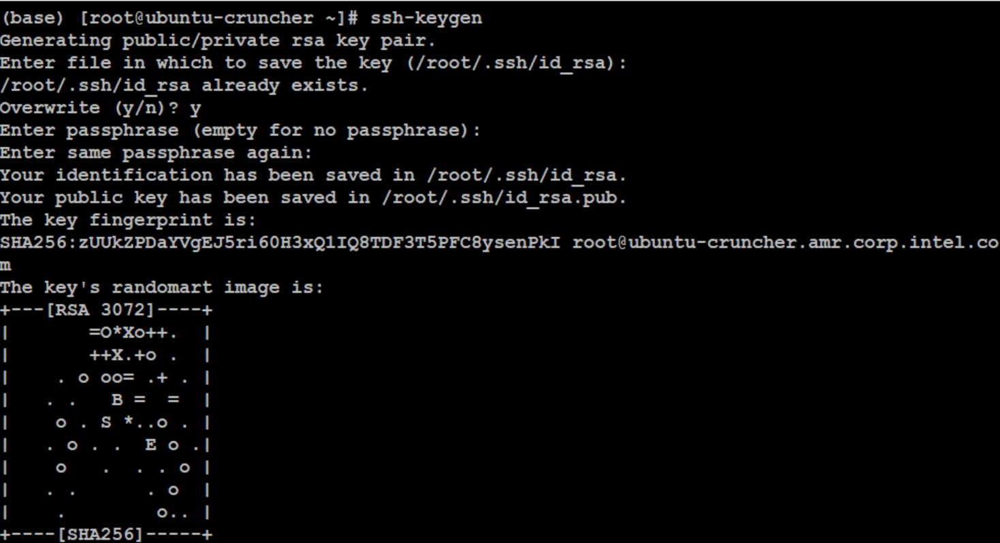

运行ssh-copy-id -i ~/.ssh/id_rsa.pub <待测机器用户名>@<待测机器IP>，需要手动输入密码。

###### 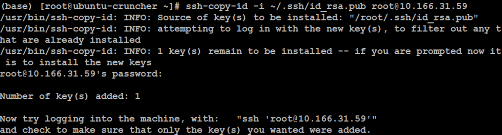

重复该改命令配置完所有待测机器的无密码登录。

### 4.12 录入配置数据

点击页面上方的admin导航栏，进入数据录入界面。

###### 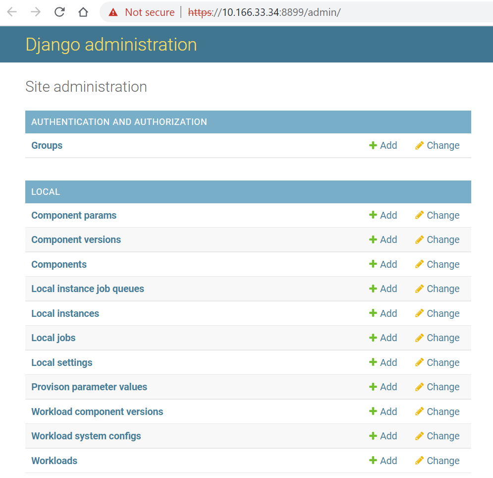

点击“Provison parameter values”，然后点击import，点击“Choose file”，选择代码仓库的文件“WSF-VaaS\portal\data\ProvisonParameterValue.csv”,然后选择类型“csv”， 点击SUBMIT，下一步点击“CONFIRM IMPORT”

###### 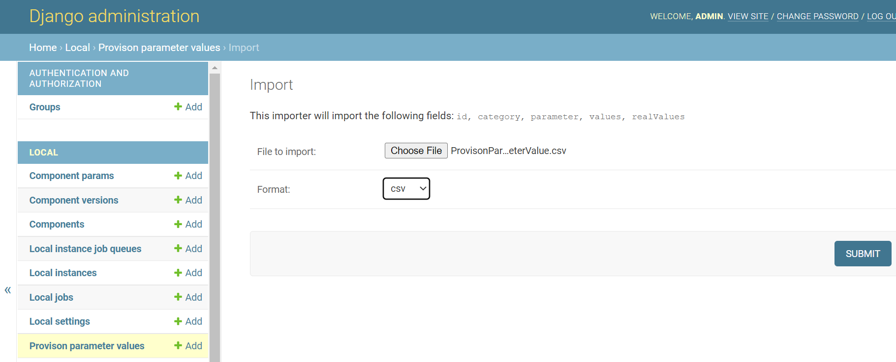

点击“[Workloads](https://10.166.33.34:8899/admin/local/workload/)”，然后点击import，点击“Choose file”，选择代码仓库的文件“WSF-VaaS\portal\data\Workloads.csv”,然后选择类型“csv”， 点击SUBMIT，下一步点击“CONFIRM IMPORT”

点击“[Component params](http://10.67.119.211:8899/admin/local/componentparam/)”，然后点击import，点击“Choose file”，选择代码仓库的文件“WSF-VaaS\portal\data\ComponentParams.csv”,然后选择类型“csv”， 点击SUBMIT，下一步点击“CONFIRM IMPORT”

点击“[Components](http://10.67.119.211:8899/admin/local/componentparam/)”，然后点击import，点击“Choose file”，选择代码仓库的文件“WSF-VaaS\portal\data\Components.csv”,然后选择类型“csv”， 点击SUBMIT，下一步点击“CONFIRM IMPORT”

点击“[Workload system configs](https://10.166.33.34:8899/admin/local/workloadsystemconfig/)”，然后点击import，点击“Choose file”，选择代码仓库的文件“WSF-VaaS\portal\data\WorkloadSystemConfigs.csv”,然后选择类型“csv”， 点击SUBMIT，下一步点击“CONFIRM IMPORT”

### 4.13 点击“Local Settings”，接着点击右上角的“ADD LOCAL SETTING”，输入Name为“provision_server_url”，值是“https://<后端服务器IP>:8089”

###### 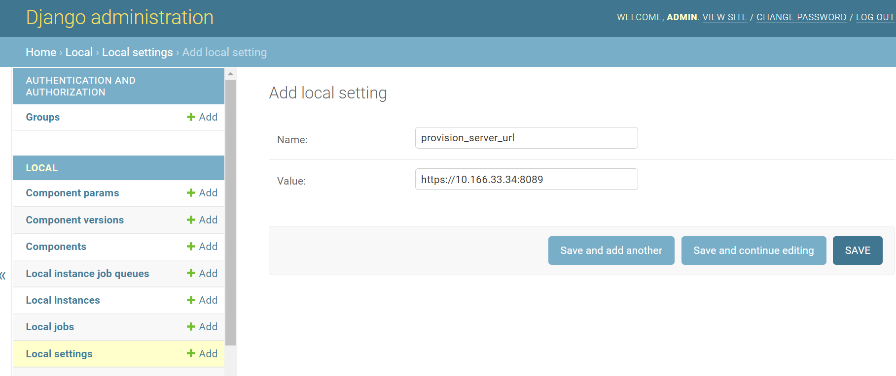

### 4.14 配置计划任务

然后在终端运行crontab -e命令，将下面一行代码加入弹出的编辑器中

*/5 * * * * cd <crontab.sh文件所在代码仓库的绝对路径> && source /etc/profile && ./crontab.sh <前端服务器url>

然后:wq保存退出

例子：

*/5 * * * * cd /home/kevin/WSF-VaaS/portal/backend && source /etc/profile && ./crontab.sh <https://10.166.33.34:8899>

### 4.15 在配置文件”WSF-VaaS/auto-provision/conf/conf.json”修改status中的url

```shell
vi WSF-VaaS/auto-provision/conf/conf.json
```

替换“\<Frontend server IP address\>”为前端服务器的IP

## 5. 部署jenkins和jfrog服务

### 5.1 启动jenkins/registry/jfrog 容器

#### 5.1.1 创建docker compose 和docker file

```shell
# 切换目录: 
cd WSF-VaaS/jenkins/
# 创建文件Dockerfile.jenkins
touch Dockerfile.jenkins
```

拷贝下面的内容到Dockerfile.jenkins文件中

```txt
FROM jenkins/jenkins:lts
COPY plugins.txt /usr/share/jenkins/ref/plugins.txt
#RUN jenkins-plugin-cli --plugin-file /usr/share/jenkins/ref/plugins.txt
#COPY ./script /usr/share/jenkins/script
```

#### 5.1.2 构建需要的容器镜像

```shell
docker compose build
```

如果环境需要配置proxy，可以增加以下参数后运行

```shell
docker compose build  --build-arg http_proxy="你的http代理地址" --build-arg https_proxy="你的https代理地址" 
```

#### 5.1.3 启动容器环境

```shell
docker compose up -d
```

### 5.2 更新registory地址配置

#### 5.2.1 打开浏览器，输入https://<服务器IP>:8899， 点击上方的“admin”导航页面，进入到后端配置界面

#### 5.2.2 点击“[Provison parameter values](https://10.166.33.34:8899/admin/local/provisonparametervalue/)”，找到PARAMETER的名字为“registry”的数据，点击他的ID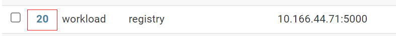

#### 5.2.3 更改VALUES为“http://<服务器IP>:5000 ”，点击“SAVE”

###### 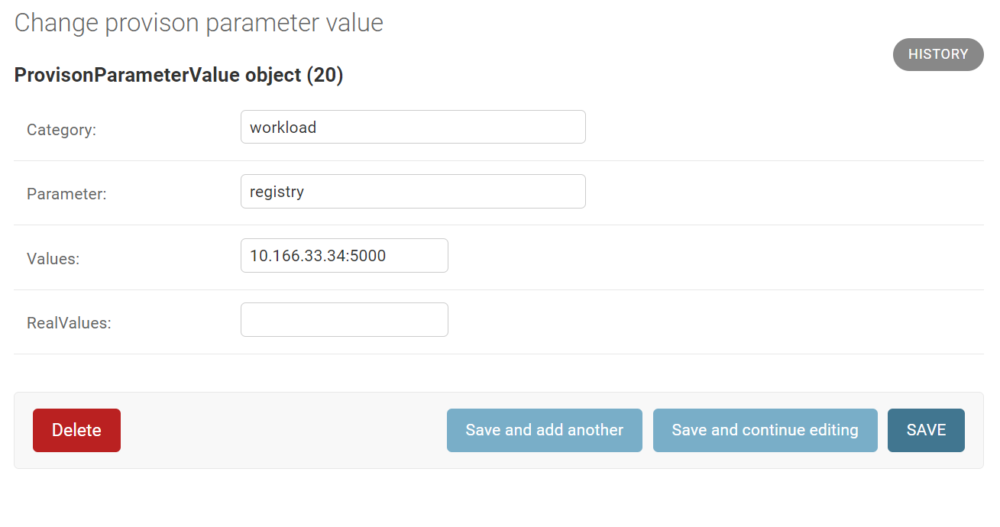

### 5.3 配置jfrog

#### 5.3.1 打开浏览器，输入地址http://< 服务器IP >:8082，会弹出登录界面，初始密码是admin/password, 点击“login“

###### 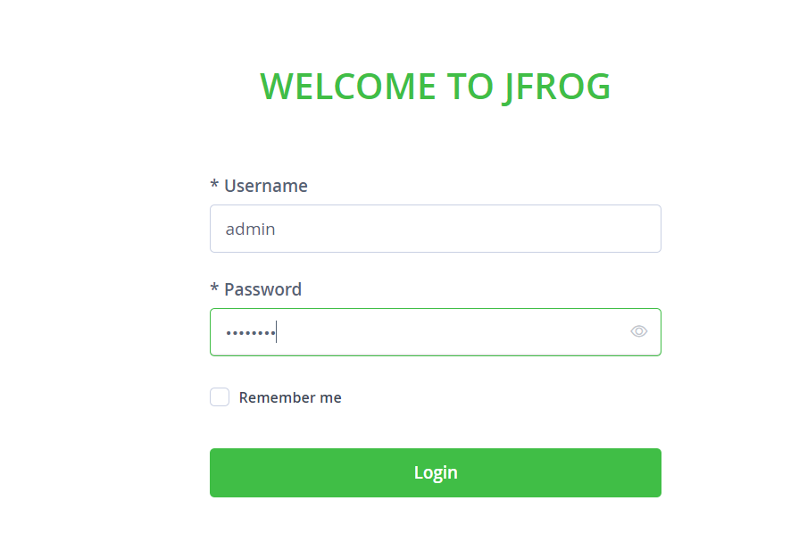

#### 5.3.2 系统会弹出设置向导，点击“Get started“

###### 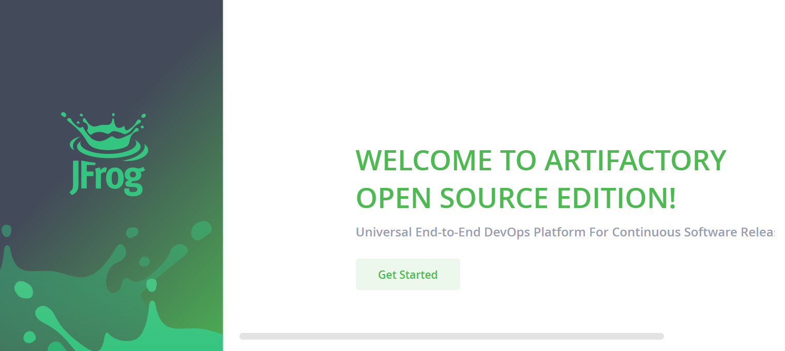

#### 5.3.3 更改默认密码，点击“next“

###### 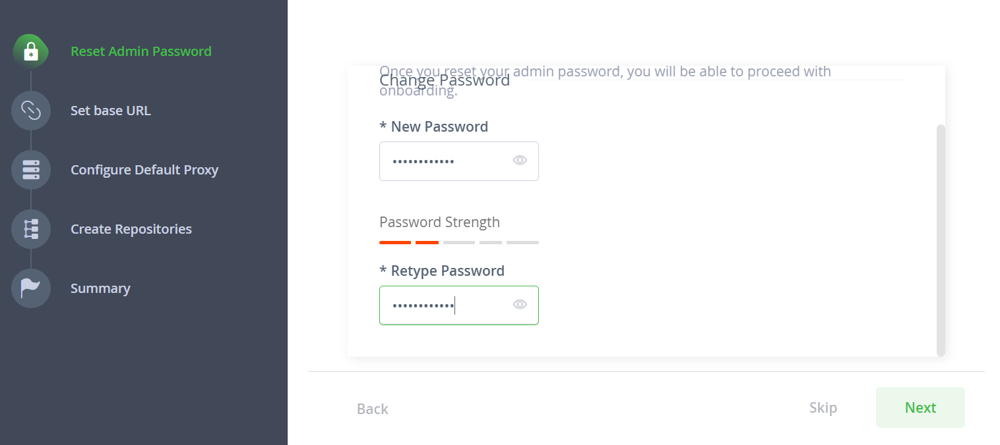

#### 5.3.4 设置base url为http://<当前服务器IP>:8082,点击“Next“

###### 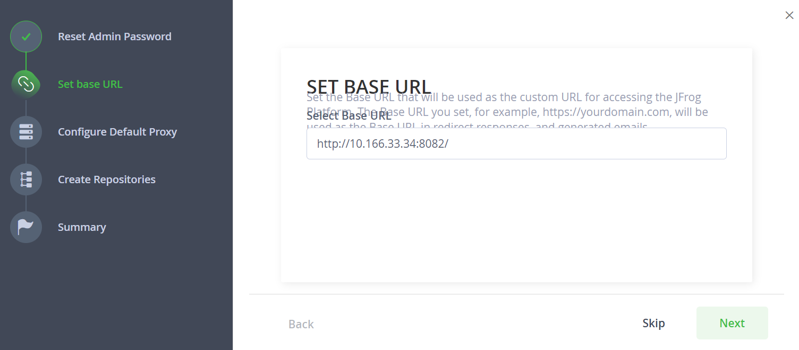

#### 5.3.5 如果当前服务器需要配置proxy，配置和服务器一样的即可，如果没有则跳过此步。

###### 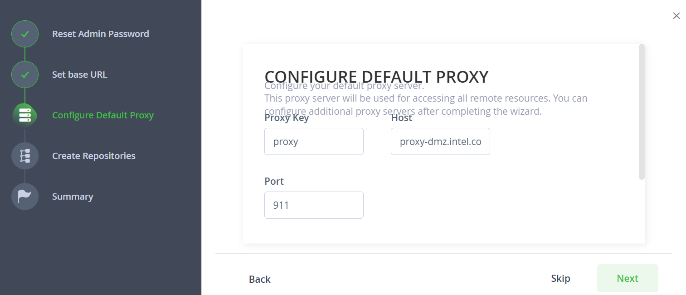

#### 5.3.6 在“create Repositories“栏，点击”Generic“，然后点击”Next“

###### 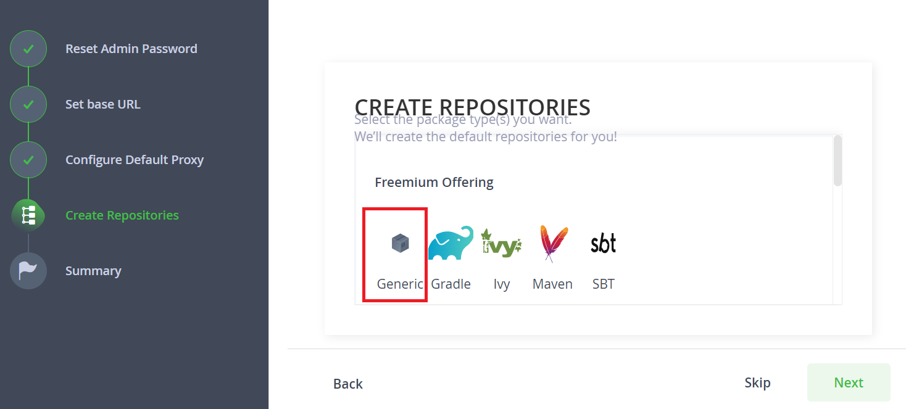

#### 5.3.7 点击finish结束配置

#### 5.3.8 进入jfrog主页之后，点击“repositories“->”Add repositories“->”Local repository”

###### 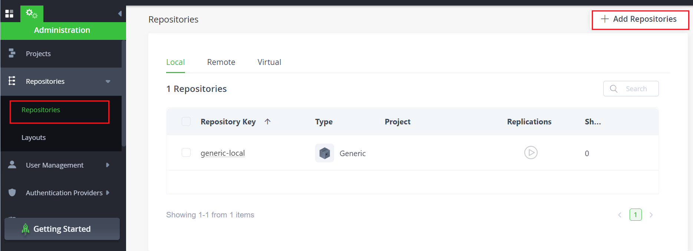

#### 5.3.9 然后点击“Generic“，在” Repository Key “输入” auto_provision“， 点击”Create local Repository“

###### 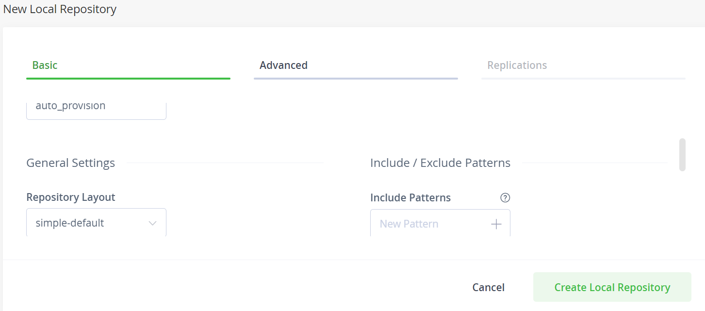

#### 5.3.10 输入url http://<服务器IP>:8082/ui/native/auto_provision/，出现字符“No items found. “说明repository创建成功

###### 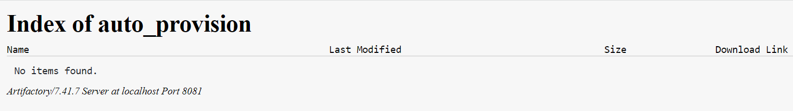

#### 5.3.11 修改WSF-VaaS/auto-provision/conf/conf.json

```shell
vi WSF-VaaS/auto-provision/conf/conf.json
```

替换“\<Jfrog server IP address\>”为实际的jfrog服务器IP

### 5.4 配置jenkins

#### 5.4.1 打开浏览器，输入地址http://<服务器IP>:8080，会弹出需要jenkins的初始密码

###### 

#### 5.4.2 服务器运行命令找到jenkins的初始密码，并填入浏览器，点击“continue”

```shell
docker exec -it jenkins bash
cat /var/jenkins_home/secrets/initialAdminPassword
exit
```

#### 5.4.3 如果网络环境需要配置代理，会弹出以下界面，需要根据实际的网络配置代理，如果机器能直接联网，则不会弹出以下界面，可忽略以下配置。

###### 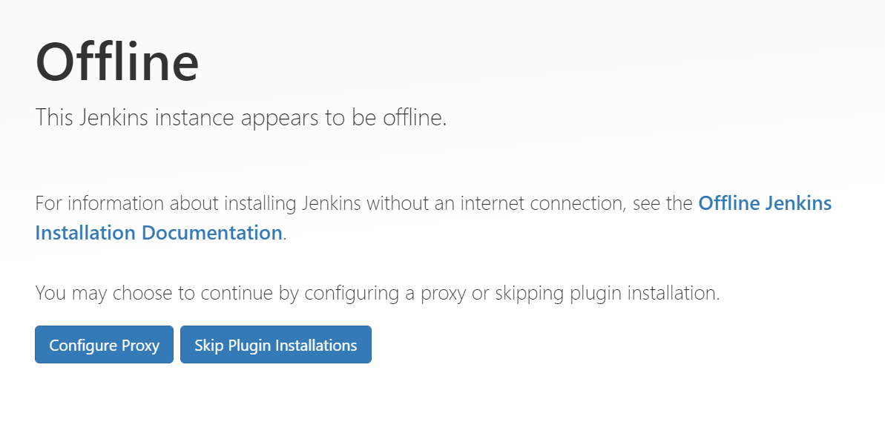

#### 5.4.4 如果需要，点击configure proxy配置代理，与宿主机的代理配置一样即可，配置好之后继续点击“continue”

###### 

#### 5.4.5 点击“Install suggested plugins”安装推荐的插件

###### 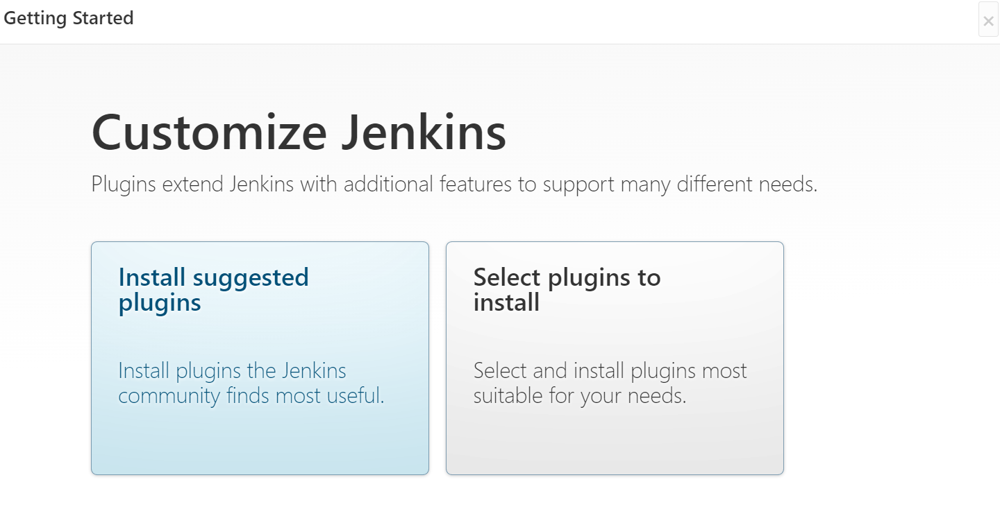

#### 5.4.6 按需要配置额外的用户，本系统推荐继续使用admin用户，所以点击“skip and continue as admin”即可。

###### 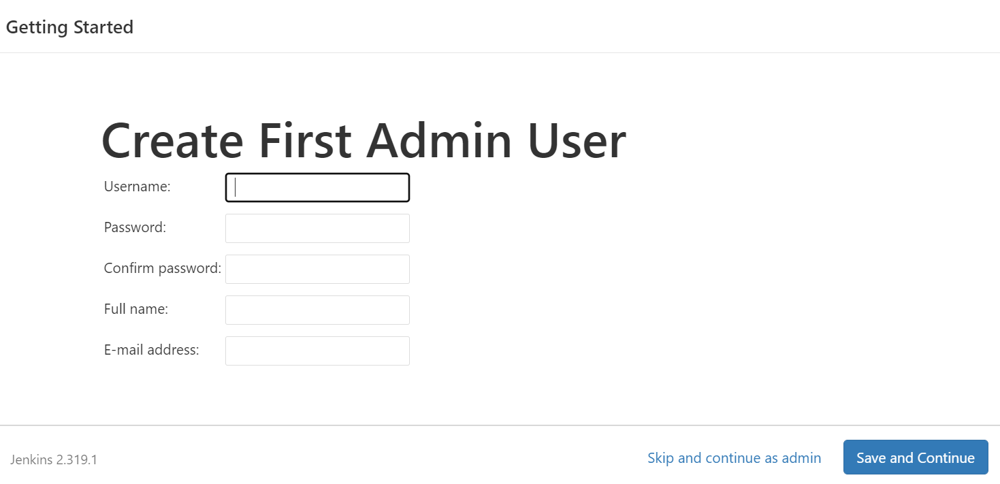

#### 5.4.7 配置jenkins url，检查url是不是http://<服务器IP>:8080, 一版情况下不需要修改，直接点击“save and finish”

###### 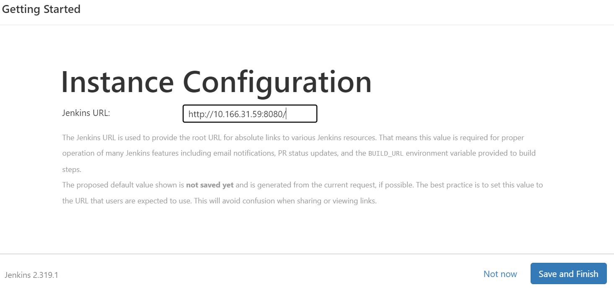

#### 5.4.8 若出现如下页面，点击“restart”重启jenkins让配置生效，如果页面重启之后没有自动刷新，等2分钟自己手动刷新。

###### 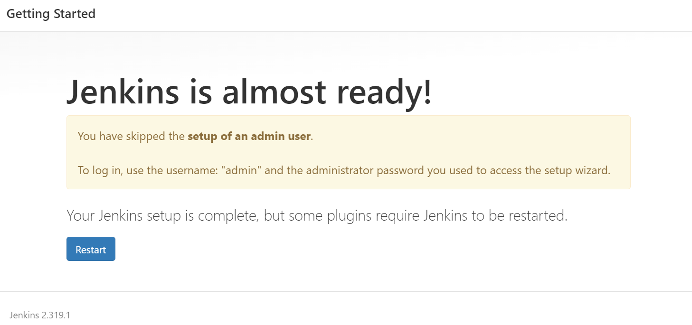

#### 5.4.9 如果需要，可以手动更改admin的密码

###### 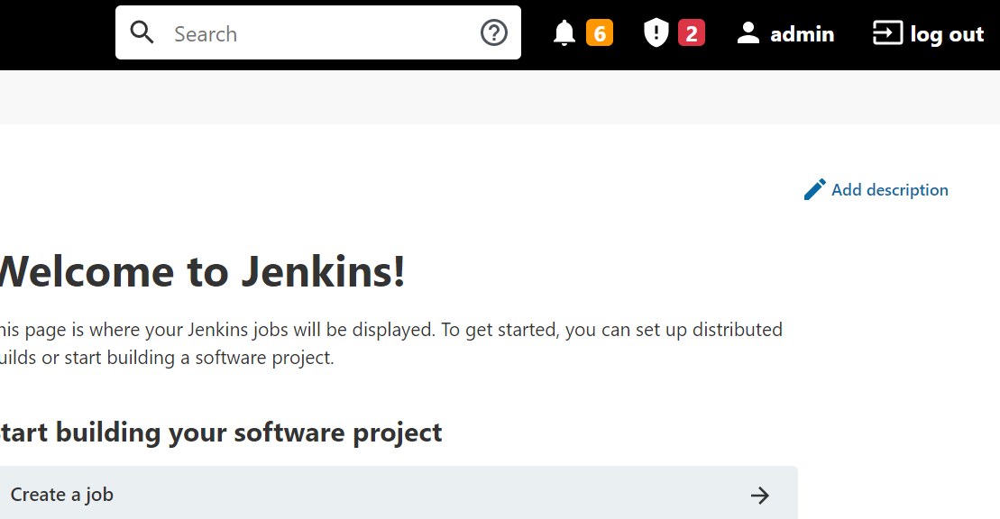

点击主页右上角的admin->configure->password, 输入需要修改的密码，点击save，然后重新用新的admin密码登录

###### 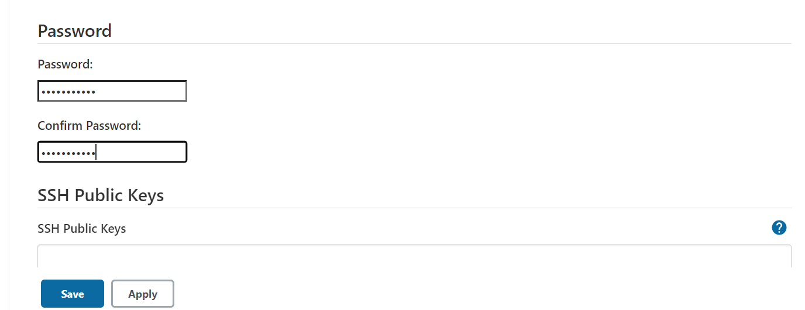

#### 5.4.10 单独安装artifactory插件

jenkins首页点击“Manage Jenkins”->“Manage Plugins”->“Available”，搜索框输入“Artifactory”，勾选搜索出来的“Artifactory”插件，点击“Install without restart”

###### 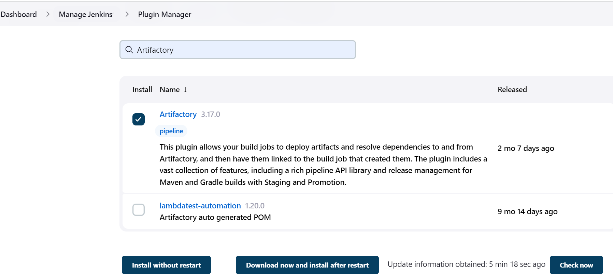

#### 5.4.11 访问url“http://<服务器IP>:8080/restart” 之后点击“yes”重启jenkins，如果页面重启之后没有自动刷新，等2分钟自己手动刷新。

###### 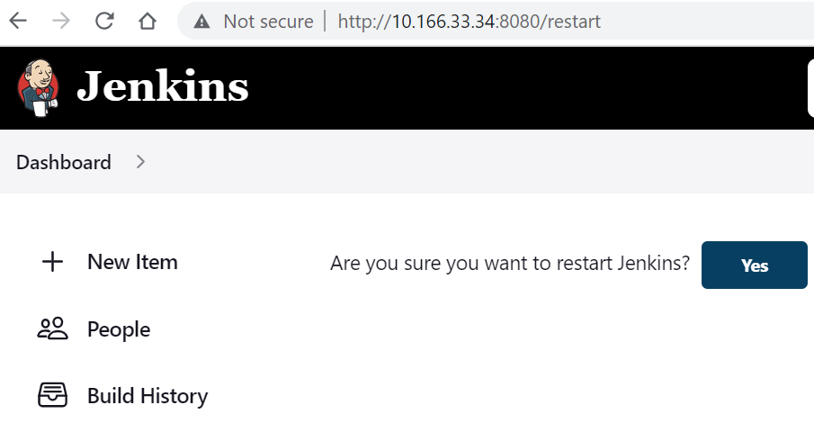

#### 5.4.12 生成admin的token，用于后端程序调用jenkins使用。点击admin->configure->Add new token，输入token名字，可随意指定，并点击“generate”，然后记住这个生成的token，离开页面之后token将无法获取。最后点击“save”

###### 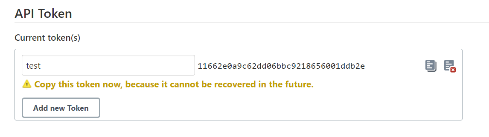

#### 5.4.13 配置token到vault

服务器输入命令“vault kv get -format=json kv/wsf-secret-password”，记住已经配置好的键值对。输出如下：

```shell
[root@node1 jenkins]# vault kv get -format=json kv/wsf-secret-password
{
"request_id": "c1cf0b2d-e3f2-9f24-d6a7-7e3c00c1947a",
"lease_id": "",
"lease_duration": 2764800,
"renewable": false,
"data": {
"jenkinsToken": "111dccb0de0a0fd04ae4edb7e9f3978153",
"jenkinsUserName": "longcaiz",
"portalPassword": "123123",
"portalUserName": "test",
"provisionPassword": "admin",
"provisionUserName": "admin"
},
"warnings": null
}
```

输入命令更新jenkins token：

```shell
vault kv put -format=json kv/wsf-secret-password jenkinsToken=<上一步生成的token> jenkinsUserName=admin portalPassword=<vault get 获取到的portalPassword > portalUserName=<vault get 获取到的portalUserName > provisionPassword=<vault get 获取到的provisionPassword > provisionUserName=<vault get 获取到的provisionUserName >
```

#### 5.4.14 配置jenkins agent（这一步的目的是把当前服务器配置成jenkins的agent），

切换conda虚拟环境，在服务器安装jenkins agent需要的包，

```shell
conda activate base
yum install -y cmake make m4 gawk git python3
pip3 install lxml paramiko pyyaml
```

用命令“java -version”确认服务器是否安装java，如果没有，安装JDK11或以上版本

然后访问jenkins主页，点击“manage jenkins”->“ Manage Nodes and Clouds”->”new node”

###### 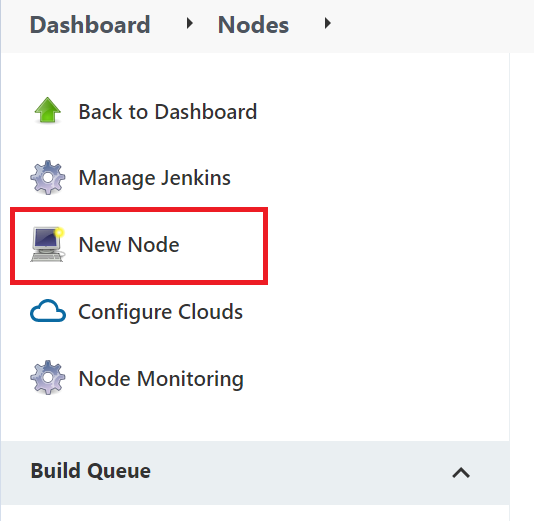

输入Node name “node1”，勾上“Permanent Agent”，点击“OK”

###### 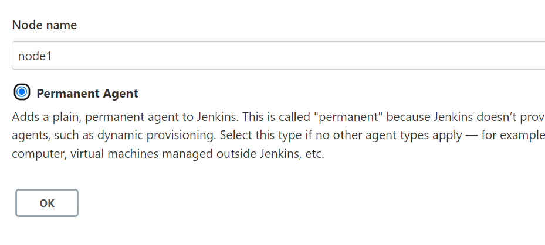

在“Number of executors”输入数字10，“remote root directory”输入“/home”,

###### 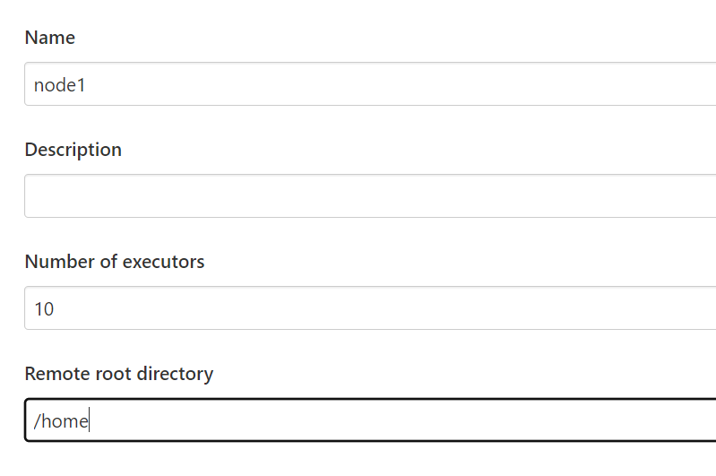

“Launch method”选择“Launch agents via SSH”，host填入当前服务器的IP

###### 

在credential栏点击add->Jenkins, 填入当前服务器的ssh用户名和密码，ID用于识别该用户名密码，可以随意填写。然后点击“Add”

###### 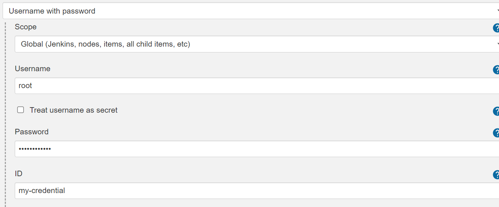

然后在刷新的页面选取刚才填入的credential，在“Host Key Verification Strategy”选择“Non verifying Verification Strategy”，点击最下方的“save”按钮

###### 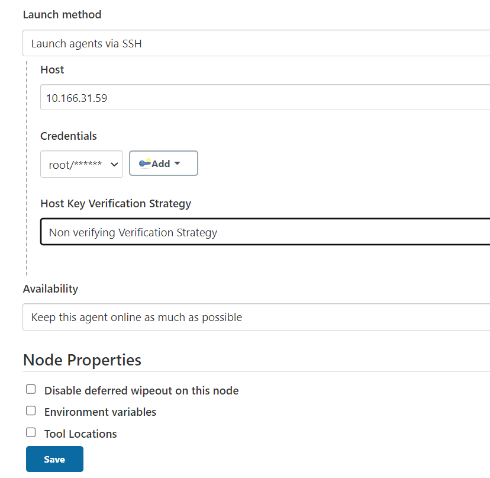

点击刚才创建好的agent名字“node1”

###### 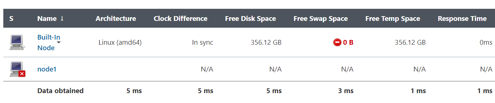

点击左边的“log”，如果末尾出现字符“Agent successfully connected and online”，则说明agnet添加成功

###### 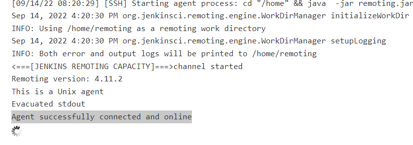

#### 5.4.15 在node1中配置VAULT_ADDR与VAULT_TOKEN

将鼠标置于node1文字上，出现下拉框后点击Configure进入配置页面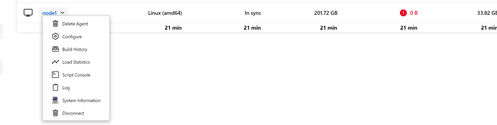

进入Configure页面后，拉至最下，勾选Environment variables选项

在其中将部署vault时所记录的VAULT_ADDR与VAULT_TOKEN按如下方式录入

最后点击Save按钮完成配置

#### 5.4.16 创建jenkins任务“image”，回到jenkins主页，点击“New Item”,在“Enter an item name”输入“image”，在下方选择“Pipeline”，点击OK

###### 

在第一步下载的代码仓库里面，找到文件，“WSF-VaaS/jenkins/script/build_image.groovy”，复制文件的内容。

在下一个页面往下拉，找到pipeline，在pipeline script下面粘贴文件的内容，点击save。

###### 

点击“build now”，第一次build一定会失败，这一步是为了生成jenkins的传入参数

###### 

#### 5.4.17 创建jenkins任务“full_benchmark”，回到jenkins主页，点击“New Item”,在“Enter an item name”输入“full_benchmark”，在下方选择“Pipeline”，点击OK

###### 

在第一步下载的代码仓库里面，找到文件“WSF-VaaS/jenkins/script/full_validation.groovy”，复制文件的内容。

在下一个页面往下拉，找到pipeline，在pipeline script下面粘贴文件的内容，点击save。

###### 

点击“build now”，第一次build一定会失败，这一步是为了生成jenkins的传入参数.

###### 

#### 5.4.18 创建jenkins任务“benchmark”，回到jenkins主页，点击“New Item”,在“Enter an item name”输入“benchmark”，在下方选择“Pipeline”，点击OK

###### 

在第一步下载的代码仓库里面，找到文件“WSF-VaaS/jenkins/script/single_benchmark.groovy”，复制文件的内容。

在下一个页面往下拉，找到pipeline，在pipeline script下面粘贴文件的内容，点击save。

###### 

点击“build now”，第一次build一定会失败，这一步是为了生成jenkins的传入参数.

###### 

#### 5.4.19 在jenkins中保存jfrog server的用户名密码，并命名为“jfrog”

进入jenkins主页，点击右上方的用户“admin”->“Credentials”

###### 

点击system

###### 

点击“Global credentials(unrestricted)”

###### 

点击“Add credentials”

###### 

填入jfrog的用户名密码，id和description都填“jfrog”，然后点击OK

###### 

#### 5.4.20 拷贝jenkins需要的脚本到指定目录

```shell
cp -r WSF-VaaS/jenkins/script /var/lib/
```

#### 5.4.21 在配置文件”WSF-VaaS/auto-provision/conf/conf.json”修改jenkins的地址

```shell
vi WSF-VaaS/auto-provision/conf/conf.json
```

替换“\<Jenkins server IP address\>”为jenkins的服务器IP

## 6. 附录

### 6.1 进行Provision的DeployHost Args设置时，所选择的Controller与Worker中的所有机器需要设置相同的用户名

### 6.2 同时，这些用户名都要具备不输密码就可执行sudo命令的权限，参考文档《新增sudo免密账户.docx》

### 6.3 为确保kubespray自动化部署k8s集群的过程顺利，要先手动将目标机上的docker先完全卸载
