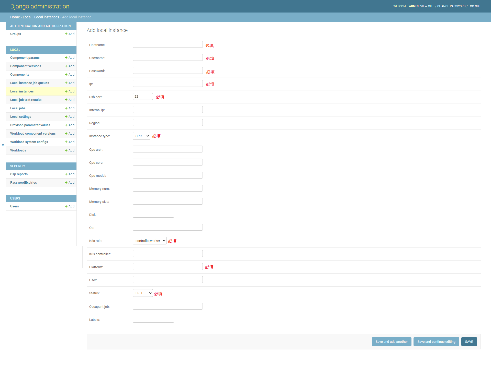
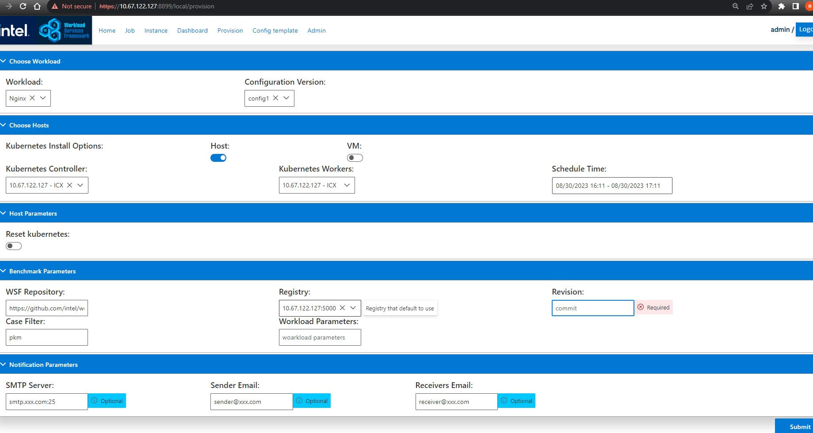
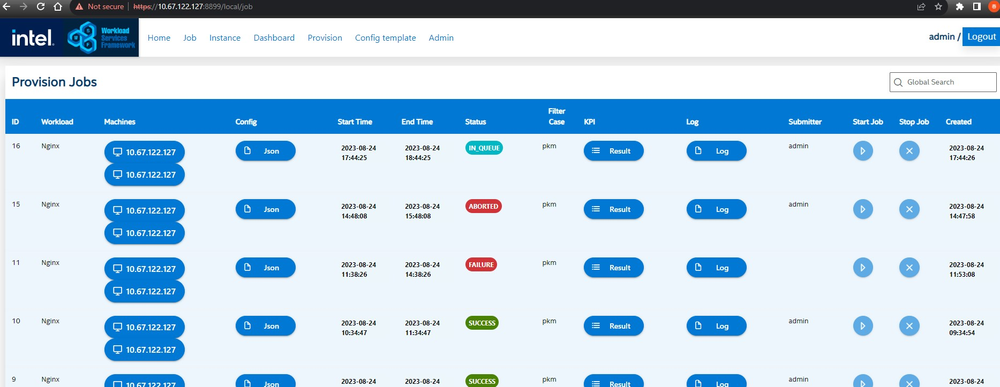
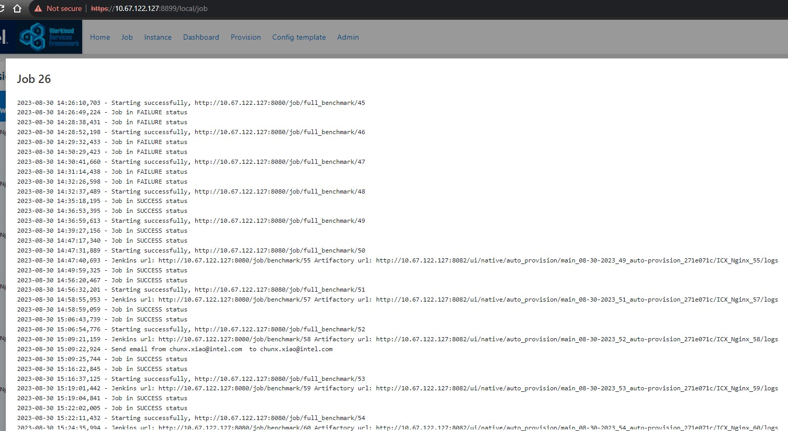
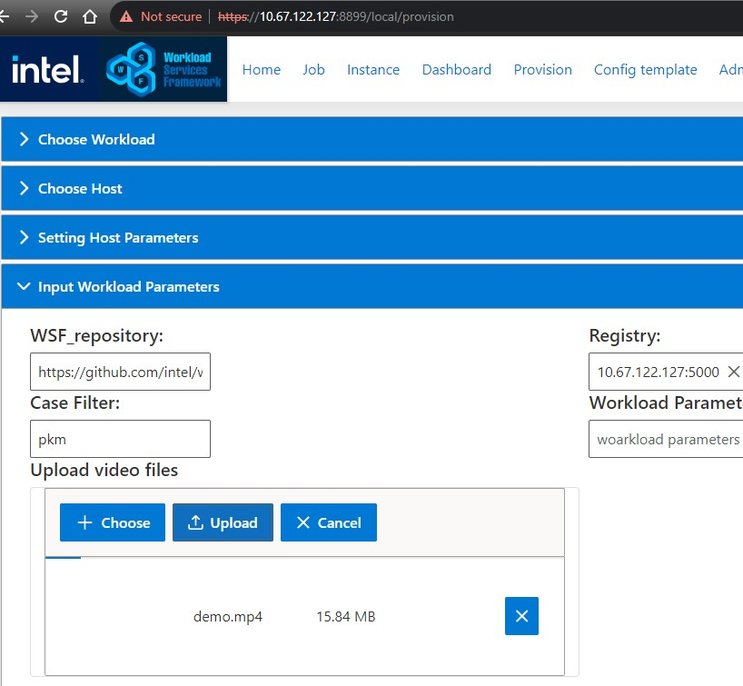

# TWDT 使用指南

本指南用于简要介绍 TWDT 的用法。TWDT 主要为精简在一系列测试服务器上执行 WSF Workload 的操作而开发。

## 1. 登录 TWDT 首页

浏览器访问 https://[TWDTHostIP]:8899 (别忘了是http而不是https协议), 然后输入 'admin' 及安装时设置的密码登录。

## 2. 登记用于执行 WSF 测试的服务器信息

在先前的安装阶段，我们安装了 TWDT 系统必要的各种组件，比如 Jfrog, Jenkins, TWDT 前端服务器及Vault密码管理器。必要的配置也已配置完毕。
然而，想要拿它来跑 WSF Workload, 我们还必须将用于执行测试的服务器信息登记入 TWDT 系统。

点击 TWDT 首页的 'Admin' 菜单， 使用 'admin' 及先前设置的密码登录。

登录成功后，点击 'Local instances' 行的 'Add' 链接。 将对应字段填充完整, 点击 'SAVE' 保存。

### 

## 3 拷贝必要的证书文件到新增服务器中

我们需要为新增的服务器做一些额外操作, 以便测试用服务器能正常拉取镜像。

终端中进入安装脚本所在根目录，然后执行如下命令：

```
./setup/setup-twdt.sh $(whoami)@[TWDTHostIP] [instance_username]@[instance_ip] --add_instance
```

# 4. 通过 TWDT 创建 Jenkins 任务

在 TWDT 首页点击 'Provision'，选择待测 'Workload'，'Configuration Version', 随后选择 'Kubernates Controller' 和 'Kubernetes Workers' 选项， 然后点击 'Submit'。

TWDT 系统将根据所填信息自动创建所需 Jenkins 任务, 并在目标服务器上执行 WSF Workload 的对应 testcase。

### 

查看刚生成的及历史 Job:

### 

点击 Log 列的 Log 标签可查看 Job 的执行进度。

### 

# Appendix

如果 workload 名字是 'Smart-Sport-Analyzer', 会显示 'Upload video files'，方便上传必要文件。

### 

