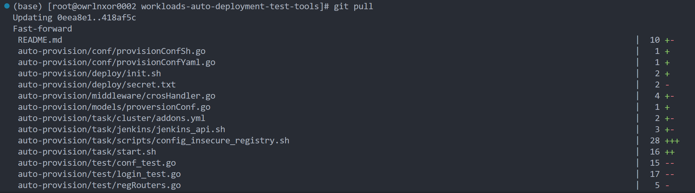
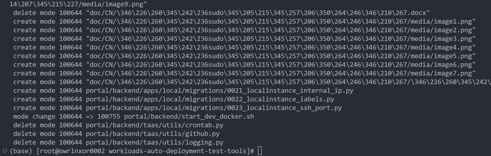

# 从22.3到22.4

## 一、暂停前后端服务

暂停前端服务，依次执行如下两行命令：

```shell
cd portal
docker-compose down
```

暂停后端服务，通过遍历端口号查找后端服务进程ID，通过 kill 命令停掉后端服务进程，命令如下：

```shell
netstat -ntlp | grep 8089	# 命令1
tcp6       0      0 :::8089                 :::*                    LISTEN      453604/./api-provis	# 输出1
kill -9 453604	# 命令2，453604即为后端服务进程号
```

## 二、备份当前配置/代码

复制如下文件的所有内容并备份：

- auto-provision/conf/conf.json
- portal/docker-compose.yml
- portal/backend/taas/settings_dev_docker.py
- portal/backend/taas/settings.py

## 三、将代码更新至v22.4并更新配置

### 1.代码更新

进入workloads-auto-deployment-test-tools文件夹，执行力命令：

```shell
git remote -v	# 下两行为输出
origin  https://github.com/intel/workloads-auto-deployment-test-tools.git (fetch)
origin  https://github.com/intel/workloads-auto-deployment-test-tools.git (push)
```

确定远程仓库链接为：https://github.com/intel/workloads-auto-deployment-test-tools.git

而后执行：

```shell
git pull
```

在执行该命令时，可能遇到类似如下提示（提示中的文件或多或少，无影响）

```shell
Updating 0eea8e1..418af5c
error: Your local changes to the following files would be overwritten by merge:
        portal/backend/start_dev_docker.sh
        portal/backend/taas/settings_dev_docker.py
        portal/docker-compose.yml
Please commit your changes or stash them before you merge.
Aborting
```

如果所提示的文件中，有我们进行过更改且在第二步中没有备份的，请对其进行备份。备份完成后，将我们对所提示文件的所有更改撤销。

撤销完成后，再次执行：

```shell
git pull
```





成功拉取最新代码后，执行如下命令将代码定位至v22.4：

```shell
[root@workloads-auto-deployment-test-tools] git reset --hard e7e45e6ea99db504c19ab829150b03612dc7a315  # 命令
HEAD is now at e7e45e6 Add 22.4 release  # 输出
```

### 2.配置更新

#### （1）文件覆盖

用第二步中的备份覆盖当前代码中的相应文件，如果在代码更新步骤中对新的文件进行备份，同样对该文件进行覆盖

#### （2）脚本重跑

执行如下命令，重跑 init.sh 文件来更新密钥

```shell
cd auto-provision/deploy # 一定要进入该文件夹后运行init.sh
./init.sh
```

## 四、启动前后端服务

### 1.启动前端服务

#### （1）重建服务

进入前端项目文件夹，重建前端服务，重建完成后启动前端服务，命令如下：

```shell
cd portal				# 命令1
docker-compose build	 # 命令2 
docker-compose up -d	 # 命令3
```

注：执行命令2时，如有需要，将其更改为如下命令后执行：

```shell
docker-compose build --build-arg http_proxy="<Your http proxy>" --build-arg https_proxy="<Your https proxy>"
```

#### （2）应用数据表更新

执行如下命令进入 PORTS 为 8899 的 docker 容器，应用对数据表的更新：

```shell
docker ps	# 获取 CONTAINER ID
docker exec -it <backend的container id> bash	 # 通过该命令进入 backend 容器中
python3 manage.py migrate	# 应用对数据表的更改
```

#### （3）将最新数据导入前端

文件夹 portal/data 中是最新的数据，将它们导入前端页面，导入方法参考"doc/Wrokload自动部署和测试工具系统部署指南"文件中的 4.12 录入配置数据。

### 2.启动后端服务

进入后端项目文件夹，重建后端项目，重建完成后启动后端服务，命令如下：

```shell
cd auto-provision		  # 命令1
go build				 # 命令2
nohup ./api-provision &	  # 命令3
```

## 五、更新Jenkins

将最新的 jenkins/script 中的 groovy 文件（build_image.groovy, full_validation.groovy, single_benchmark.groovy）和脚本更新到jenkins服务和服务器上。

### 1.build_image.groovy

通过浏览器进入之前部署的 jenkins 服务主页，


点击主页的 image 进入其详情页，点击详情页中的 Configure 进入配置页面，


将配置页面下拉到最底部，可以看到我们之前配置好的 Pipeline Script，


将 22.4 代码中 jenkins/script/build_image.groovy 文件中的全部内容复制并覆盖网页中的 Pipeline Script；覆盖后，点击 Apply 按钮，网页顶部出现 Saved 字样则表明更新应用成功


### 2.full_validation.groovy, single_benchmark.groovy


对于 jenkins 中 benchmark 与 full_benchmark 的更新同前一步并无二致，只需将 jenkins/script/single_benchmark.groovy 对应 benchmark，jenkins/script/full_validation.groovy 对应 full_benchmark 来进行 Pipeline Script 的更新与应用即可。

### 3.更新脚本

可以选择彻底清除或者保留存放旧版本脚本的文件夹，命令分别如下：

```shell
# 将部署 jenkins 服务的服务器中的旧脚本清除
rm -rf /var/lib/script
# 留取 backup
mv /var/lib/script /var/lib/script_v22.3
```

将最新的脚本复制到 /var/lib/script 文件夹中

```shell
cp -r jenkins/script /var/lib/
```


