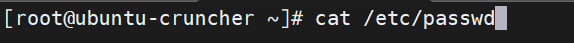
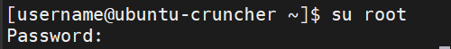
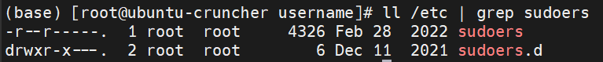
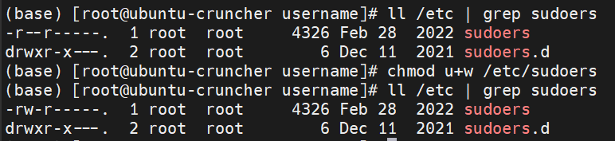
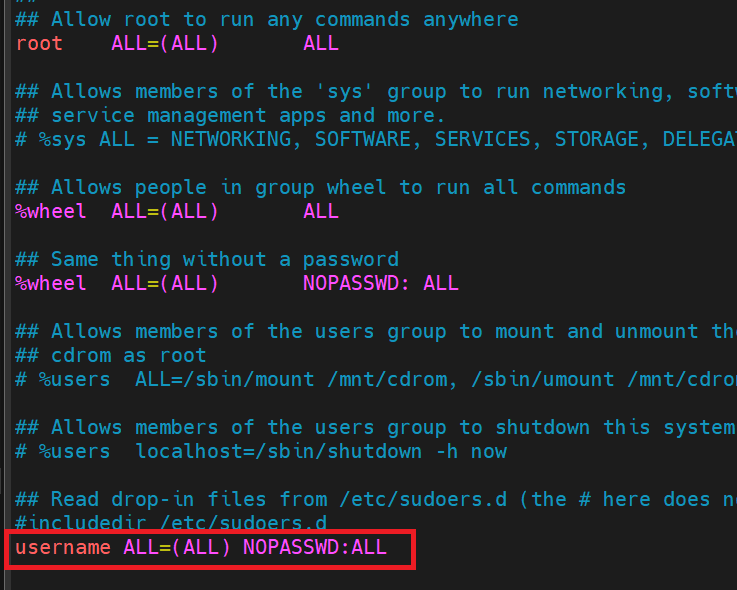
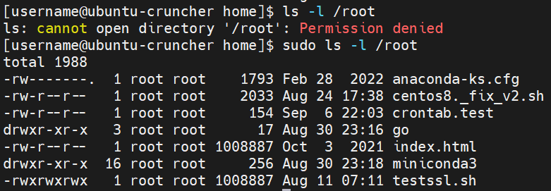

# 新增sudo免密账户

## 1. 检查当前用户

###### 

## 2. 创建一个用户，假定名字是username

```shell
useradd -m username
```

## 3. 为新用户设置密码

```shell
passwd username
```

###### 

## 4. 授予新用户sudo免密权限

### 4.1 切换到root用户

```shell
su root
```

###### 

###### 

### 4.2 增加写权限

```shell
chmod u+w /etc/sudoers
```

###### 

### 4.3 编辑文件/etc/sudoers

```shell
vim /etc/sudoers
```

添加username的sudo免密配置，如图红色框所示

###### 

### 4.4 取消/etc/sudoers的可写权限

```shell
chmod u-w /etc/sudoers
```

## 5. 检查是否配置成功

###### 
