# TWDT Installation Guide
This document is intended to provide instructions on how to install TWDT on a newly installed server that is running the Ubuntu server 22.04 LTS OS.

# 1. Ensure the time zone match the machine's physical location
To use the correct installation source for docker image build processing in the following steps, it is necessary to set the machine's time zone to match the real one.

For example, this command can set time zone to 'Asia/Shanghai':

```
sudo timedatectl set-timezone Asia/Shanghai
```

This command can list all time zones, then you can select the one you want.

```
timedatectl list-timezones
```

# 2. Set up network proxy settings in/etc/environment
In the subsequent installation process, the script file will automatically create a Docker proxy settings file based on the current terminal's proxy settings. The installation process includes a Docker build operation. In a network environment that requires proxy access, this proxy file is crucial, otherwise Docker build will always fail. Of course, if proxies are not required, we can skip this operation.

Meanwhile, to prevent accessing ourselves through a proxy and causing failure, it is necessary to add the local IP address to the 'no_proxy' list.

For example:

```
export http_proxy=http://proxy-host:port
export https_proxy=http://proxy-host:port
export no_proxy=localhost,127.0.0.1,10.0.0.0/8,192.168.0.0/16,172.16.0.0/12,10.166.0.0/16,10.244.0.0/16,10.45.247.11,10.45.247.12,10.45.247.13,10.45.247.14
```

Then execute this command to make sure these environments take effect in current terminal.

```
source /etc/environment
```

# 3 Define an environment TWDTHostIP to contains the IP address we want to use for service

In the terminal window, enter this command to define the TWDTHostIP environment variable for current terminal shell and all sub shells.

```
export TWDTHostIP=[Your correct host IP to provice service]
```

Notice: you can run command 'hostname -I' to get all IP and choice the corrent one to use.

# 4 Generate HTTPS self-signed certificate for front-end web server

As we will access the TWDT portal via the HTTPS security protocol, we need to specify a private key and certificate file during the installation phase. We can refer to this command to generate a temporary self-signed certificate for it.

In the source code directory of TWDT, execute these commands:

```
mkdir -p setup/cert
pushd setup/cert
openssl req -x509 -newkey rsa:2048 -nodes \
    -keyout $TWDTHostIP:5000.key \
    -out $TWDTHostIP:5000.crt \
    -subj "/CN=$TWDTHostIP" \
    -days 3650 \
    --addext "subjectAltName = IP:$TWDTHostIP"

chmod 644 $TWDTHostIP:5000.key $TWDTHostIP:5000.crt
popd

ln -f setup/cert/$TWDTHostIP:5000.key setup/cert/key.pem
ln -f setup/cert/$TWDTHostIP:5000.crt setup/cert/cert.pem
```

If you have submitted your application to the formal signing agency and obtained the official certificate file issued by them, you can link it to setup/cert/key.pem and setup/cert/cert.pem to take effect.

# 5 Run bash setup/setup-twdt.sh start TWDT installation imediately

In the TWDT source code directory, run this command:
```
bash setup/setup-twdt.sh "$(whoami)@$TWDTHostIP"
```

It will guide you step by step to go through the installation of all TWDT components.

Firstly, the script will set up passwordless ssh to TWDTHostIP. When you see this prompt, please input yes and current user's password.

```
Setting up passwordless ssh to raspadmin@[$TWDTHostIP]...
/usr/bin/ssh-copy-id: INFO: Source of key(s) to be installed: "/home/[$whoami]/.ssh/id_rsa.pub"
The authenticity of host '[$TWDTHostIP] ($TWDTHostIP)' can't be established.
ED25519 key fingerprint is SHA256:vXKc9NkAfQfcYuGmu9cK6wRVVmeIKaHShvd/5qRKaf0.
This key is not known by any other names
Are you sure you want to continue connecting (yes/no/[fingerprint])? yes
/usr/bin/ssh-copy-id: INFO: attempting to log in with the new key(s), to filter out any that are already installed
/usr/bin/ssh-copy-id: INFO: 1 key(s) remain to be installed -- if you are prompted now it is to install the new keys
[$whoami]@[$TWDTHostIP]s password: ________
```

Secondly, the script will setup passwordless sudo for current user. When you see this prompt, please input current user's password again.

```
Setting up passwordless sudo...(sudo password might be required)
[sudo] password for raspadmin: ________
```

Afterwards, the script will ask you to input current user's password agin. When you see this prompt, please input current user's password once again.

```
Now, please tell me current user's(raspadmin) password [used to add current host to be Jenkins agent]: ________
```

Lastly, the script will ask you some information about some information about how to set up TWDT, when you see these prompt, please input valid values.

```
Then, please input some necessary information for us to set for TWDT system:
[1/5] Enter the password that you want to use to login the TWDT web portal. [CANNOT be empty]: ________
[2/5] Enter password you want to be used to login Jfrog artifactory repository. [must be a STRONG password]: ________
[3/5] Enter password you want to be used to login Jenkins service. [CANNOT be empty]: ________
[4/5] Enter password you want to be used for Postgres database connection. [CANNOT be empty]: ________
[5/5] Enter password you use when sending EMails from your SMTP server. [if not necessary, please leave it blank]: ________
```

Till now, you can make yourself a cup of coffee and wait for the installation to be completed.

If everything goes according to plan, we will receive the following prompt indicating that the installation is finished.

```
Congratulation! Seems like everything going well. Next step, please do some configuration about changing Jfrog password and creating essential repository follow doc/install-guide.md to make sure TWDT can work properly.
```

## 6 Get these password we input before

Sometimes we forget what password we set during installation, or what password we set later. Don't worry, as long as we can still log into the host via ssh, we can read them from the Vault password safe with the following command. 

In fact, we don’t need to struggle to remember a lot of annoying passwords.

```
vault kv get -format=json kv/wsf-secret-password
```

It will output like this, and you can choose what you need.
```
$ vault kv get -format=json kv/wsf-secret-password
{
  "request_id": "706e6dca-fba9-948c-3b01-bee8fe11f124",
  "lease_id": "",
  "lease_duration": 2764800,
  "renewable": false,
  "data": {
    "JenkinsUrl": "http://[TWDTHostIP]:8080",
    "TWDTEmailSenderPassword": "",
    "TWDTHost": "[TWDTHostIP]",
    "TWDTHostPort": "22",
    "TWDTHostUser": "[user]",
    "TWDTJenkinWorkspaceDir": "/opt/benchmarking.uitools.twdt/setup/../jenkins/runtime/",
    "TWDTJenkinsPassword": "[password]",
    "TWDTJenkinsUser": "[user]",
    "TWDTJfrogPassword": "[password]",
    "TWDTOSPassword": "[password]",
    "TWDTPortalEmail": "[email]",
    "TWDTPortalPassword": "[password]",
    "TWDTPortalUser": "[user]",
    "TWDTPostgresPassword": "[password]",
    "TWDTPostgresUser": "[user]"
  },
  "warnings": null
}
```

# 7 Configure Jfrog

Due to the strong password policy requirements of the Jfrog system, we should have entered a strong password for Jfrog during the previous 
installation. However, that's only a vlue TWDT should to use to connect Jfrog, rather than the actual settings in Jfrog. 
In order for TWDT to use Jfrog normally, we now need to log in to Jfrog and manually set it to be the same as the one we entered before.

## 7.1 Login Jfrog

Access http://[TWDTHostIP]:8082/ui/login/ to login, default user name is 'admin' and password is 'password'.
###### 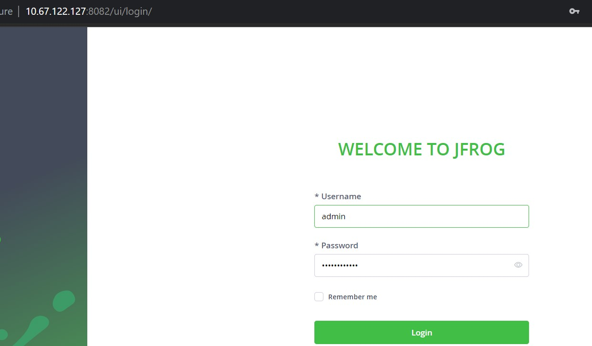

If the web page keeps showing "The JFrog Platform is warming up and should be ready shortly", it should be that Jfrog has encountered some problems. we can restart jfrog with the following command then try login again.

```
docker restart jfrog
```

The system will pop up a setup wizard for first login, where we can make the following settings. For consistency, we will explain based on the page navigation menu. I Suggest you close the wizard and follow me to complete the settings.

## 7.2 Change the password of admin

Click the "User Management" item, then select 'Users'.

###### 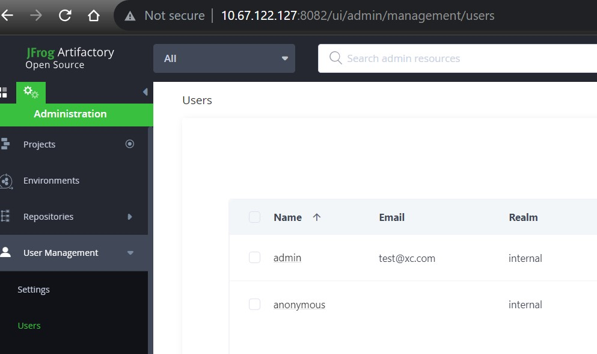

Click the 'admin' item under column 'Name', and fill the 'email' field.

###### 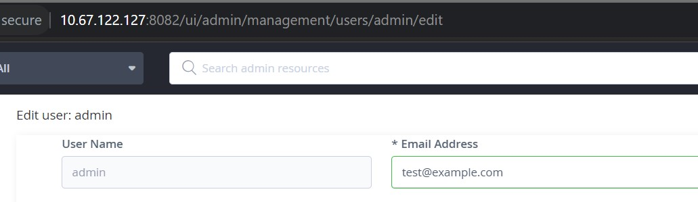

Input the strong password you entered before, then click 'Save'. Please aware it must be the same as the previous input, otherwise Jfrog will not work properly.

###### 

## 7.3 Create Jfrog repository

Now let's create the essential Jfrog repository for TWDT system to use.

Click 'Respositories', then select 'Respositories'.

###### 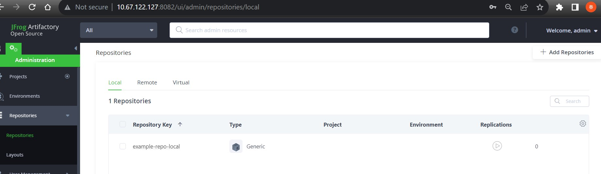

Click '+ Add Repositories' on the top right of the page, then select "Local Repository" from the pop-up list.

###### 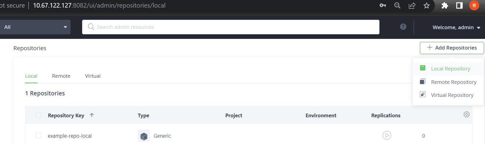

Click 'Generic' icon when you see the 'Select Package Type' prompt.

###### 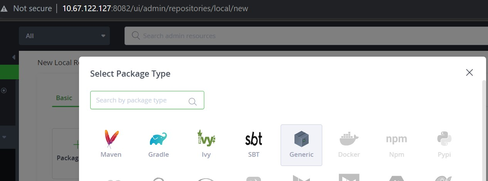

Input "auto_provision" into the 'Repository Key' field, then click "Create Local Repository".

###### 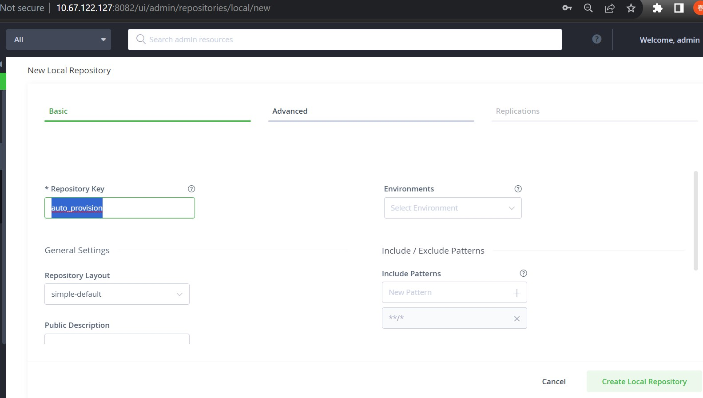

Repository created.

###### 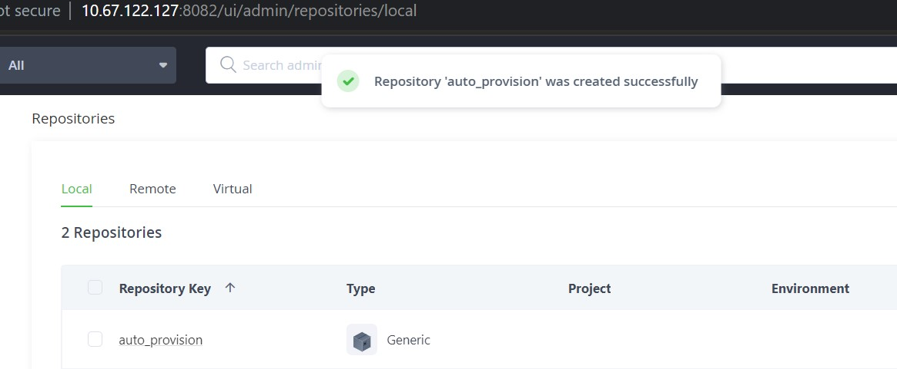

# 8 Check whether all components work well

## 8.1 TWDT portal

Access https://[TWDTHostIP]:8899, use user name 'admin' and the password you set before for TWDT portal to login.

###### 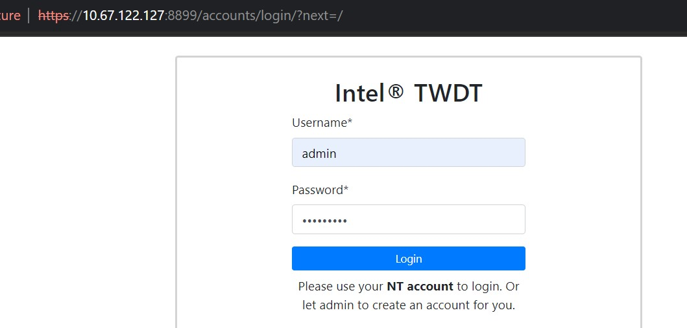

## 8.2 Jenkins

Access http://[TWDTHostIP]:8080, use user name 'admin' and the password you set before for Jenkins to login.

##### 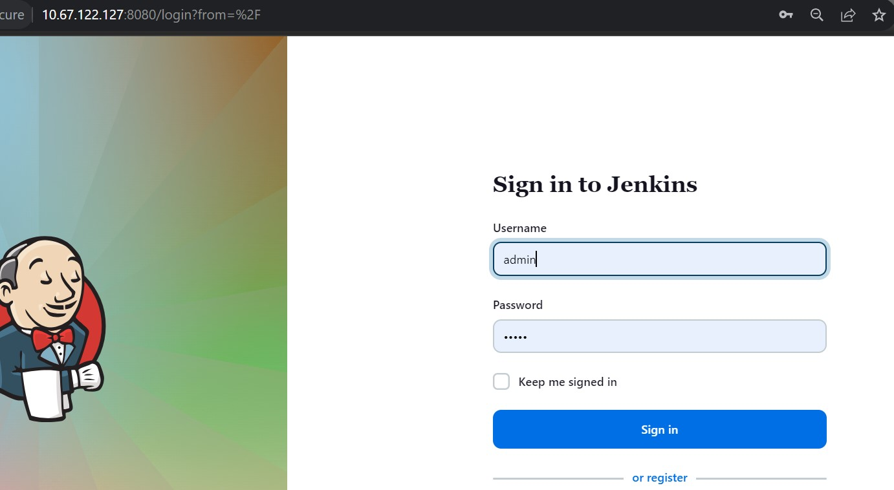

Make sure Jenkins jobs 'full_benchmark', 'benchmark' and 'image' exists.

##### 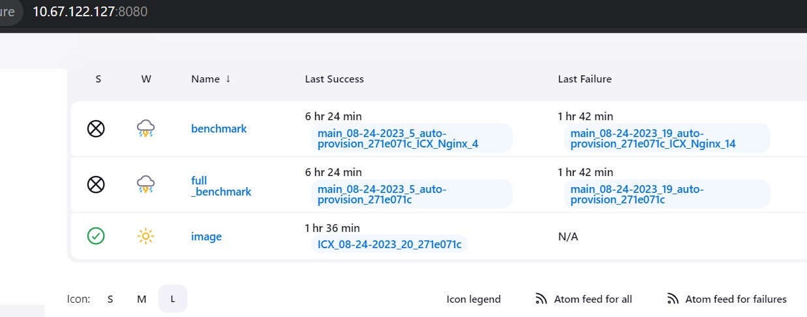

Click 'admin' on the top right of the page, then select 'Credentials'.

Make sure 'Jfrog' and 'node1Pass' exists in the 'Credentials' section's ID column. The 'Jfrog' is the password setting for Jfrog, and 'node1Pass' is the password setting for TWDT.

##### 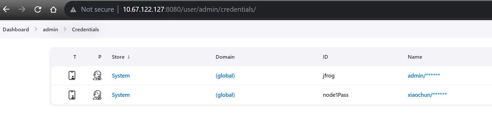

Click 'admin' on the top right of the page, then select 'Configure'.

Make sure 'my-vaas-token' exists in the 'API Token' section, it will be used to perform Jenkins API requests.

##### 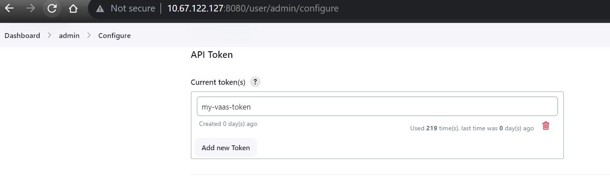

Click 'Jenkins' icon on the top left of the page, then select 'Manage Jenkins', then 'System'.

Make sure 'VAULT_ADDR' and 'VAULT_TOKEN' exists in the page.

##### 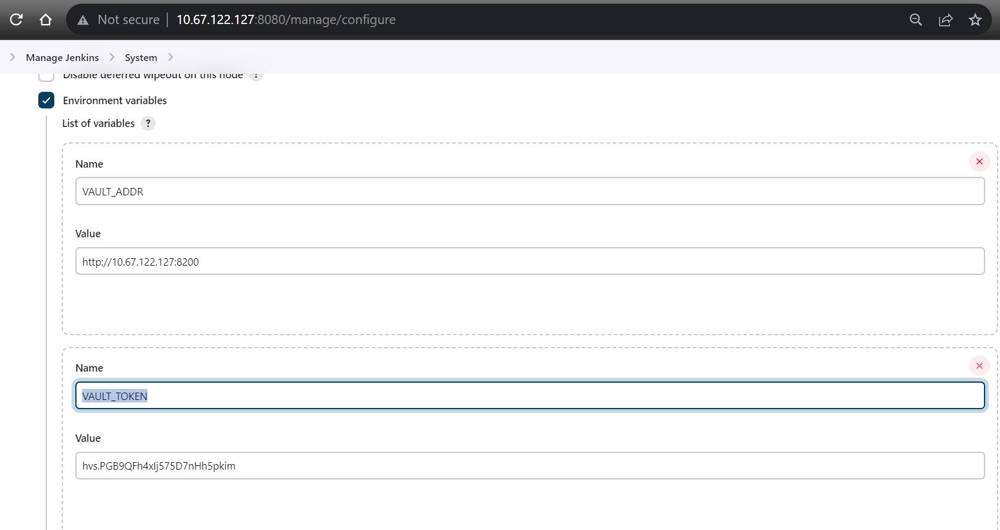
Click 'Jenkins' icon on the top left of the page, then select 'Manage Jenkins', then 'Nodes'.

Make sure 'node1' exists in the Nodes list and 'Clock Difference' status is 'In sync'.

##### 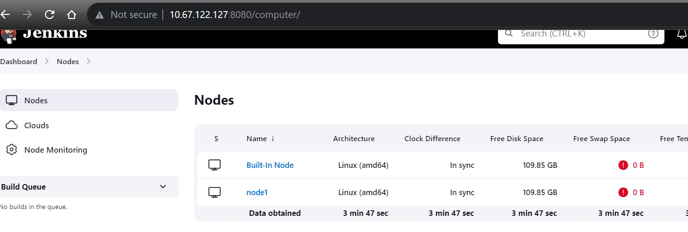


