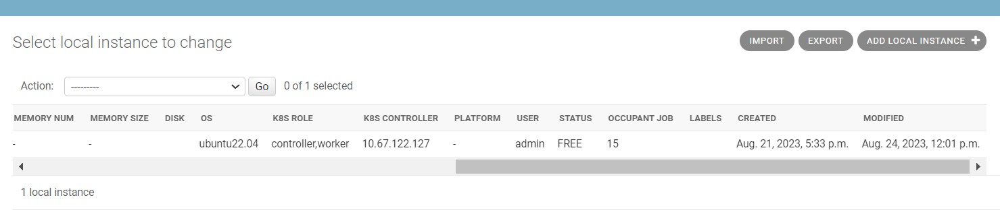
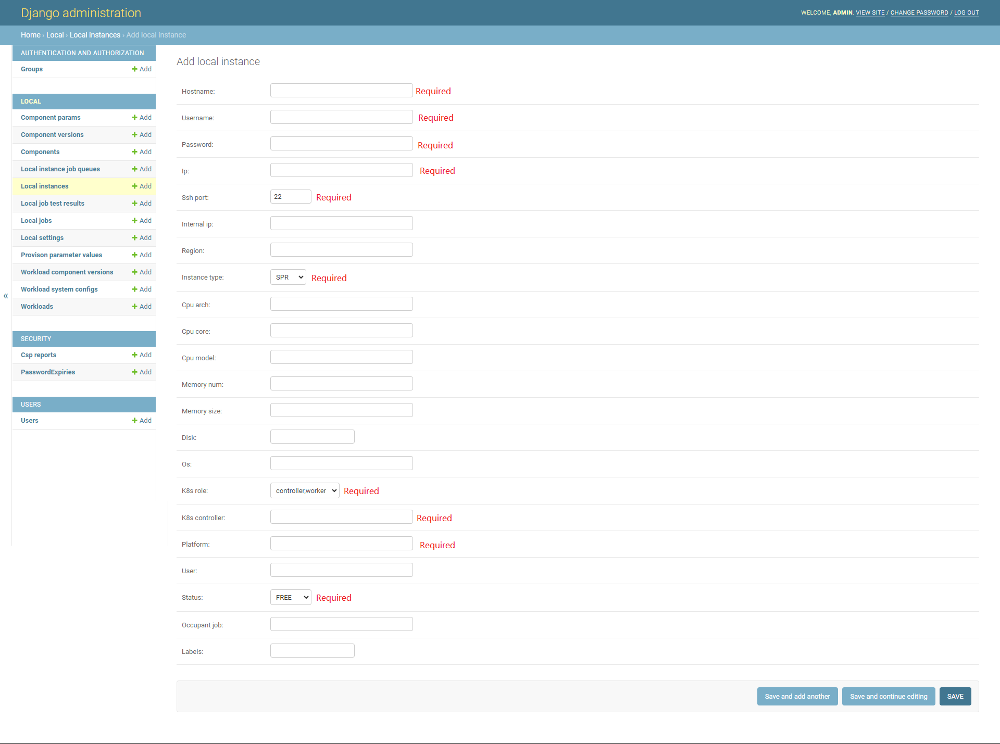

# TWDT User Guide

# 1.Login to TWDT portal

Access https://[TWDTHostIP]:8899, use user name 'admin' and the password you set before for TWDT portal to login.

# 2. Register instance to TWDT

In the previous installation phase, we installed various necessary components, such as Jfrog, Jenkins, TWDT front-end
and Vault, and essential configurations have been done. However, in order to run WSF workload, we need to register server information to TWDT.

Click 'Admin' in the portal homepage, use user name 'admin' and the password you set before for TWDT portal to login.

When login succeed, click 'Add' button in the 'Loal instances' row.

###### 

Fill required fields, then click 'SAVE'.

###### 

# 3. Copy essential certification file to new added instance
We need to do some additional operations to complete some relevant settings.

In terminal window, run command like this:

```
./setup/setup-twdt.sh $(whoami)@[TWDTHostIP] [instance_username]@[instance_ip] --add_instance
```

# 4. Use TWDT to create Jenkins task

Click 'Provision' in the portal homepage, select dedicated 'Workload', 'Configuration Version', 'Kubernetes Controller" and 'Kubernetes Workers' options, then click 'Submit'.

Then TWDT will trigger Jenkins automatically.

###### 

Check Provision Jobs:

###### 

We can click responding job's 'Log' button to check progress log.

###### 

# Appendix

If workload is "Smart-Sport-Analyzer", "Upload video files" will show.

###### 
